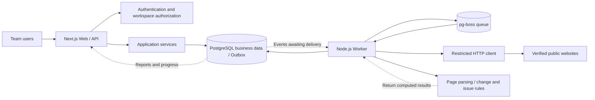
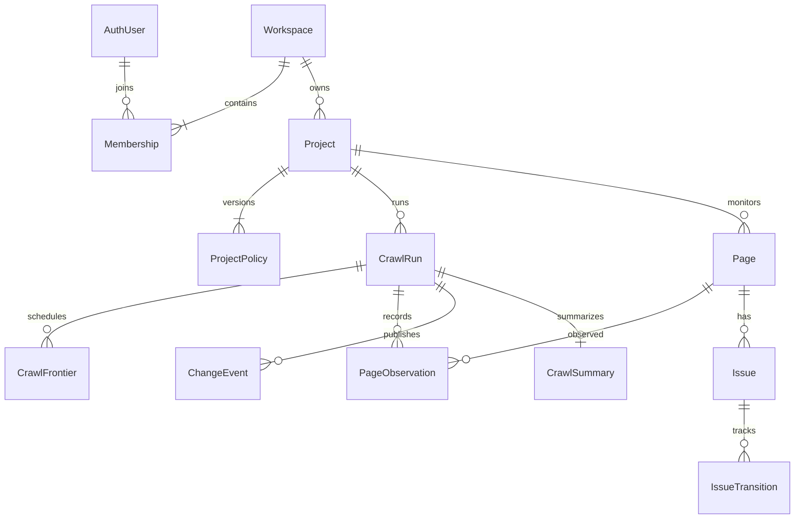

# Indexly System Architecture

[简体中文](./ARCHITECTURE.md) | English

Design date: 2026-09-06, last updated 2026-09-07. Status: the core loop (P0–P4) and the site health score are implemented per this design; P5 enhancements such as email reports, Webhooks, and link graphs are not yet implemented. The user has confirmed that the first release will serve teams or multiple users.

This document defines product boundaries, system responsibilities, data contracts, and operational constraints. See [IMPLEMENTATION_PLAN.en.md](./IMPLEMENTATION_PLAN.en.md) for the implementation sequence. The repository now contains the workspaces/projects/crawling/reporting/scheduling/cleanup implementations; the semantics described in each section follow the behavior verified by tests.

## 1. Product Goals and Scope

Indexly helps teams understand which technical SEO changes have occurred since the last valid crawl, which pages are affected, which issues remain, and which issues have been confirmed as resolved by a subsequent crawl.

The first release provides this workflow: create a workspace → invite members → create a project and verify its domain → run a manual or weekly crawl → save page observations → publish the change report and issue states → inspect evidence and history.

| Area | First-release decision |
| --- | --- |
| User organization | A user can join multiple workspaces; each workspace contains multiple projects; membership permissions cover all projects in that workspace |
| Supported websites | Publicly accessible websites with parseable HTTP response content; no login to target sites and no execution of page JavaScript |
| Monitoring | HTTP status, redirects, robots indexing directives, canonical declarations, titles, descriptions, and internal link counts |
| Issue management | Automatic detection, automatic confirmation of resolution, recurrence, and suppression; evidence and timelines are retained |
| Crawl triggers | Manual crawls and weekly schedules; at most one active run per project |
| Initial scale assumption | Approximately 50 active projects in total, with at most 5,000 page identities per project; deployment capacity must be validated through load testing |
| Later capabilities | Browser rendering, link graphs and broken-link tracing, email reports, Webhooks, and third-party SEO platform integrations |
| Out of scope | Search ranking tracking, keyword research, billing plans, web-wide crawling, and automatically modifying customer websites |

Pages display only metrics supported by implemented functionality. The site health score is implemented and displayed per the formula, coverage gate, and versioning policy in Section 9; metrics such as broken-link counts will be enabled when the link-graph capability (P5) lands.

## 2. Architecture Decisions

Use a modular monolith codebase, deployed as separate Web and Worker processes that share PostgreSQL. Crawl work runs through a persistent queue.



The business tables, Outbox, and queue in the diagram all reside in the same PostgreSQL instance; queue tables use a separate schema. The Worker handles queue consumption, Outbox delivery, schedule scanning, and recovery of stalled tasks. The first release does not introduce separate services for these responsibilities.

| Layer | Technology and responsibility | Trade-off |
| --- | --- | --- |
| Web and API | Retain Next.js App Router, React, and TypeScript; Route Handlers use the Node runtime | Continues the existing stack; HTTP requests execute only short transactions and queries |
| Authentication | Better Auth, database sessions, email verification, and invitation-only registration | Reuses identity, session, and credential handling; business modules provide centralized workspace authorization |
| Application services | TypeScript use-case services and a data access layer | Pages, APIs, and internal tasks reuse the same business constraints |
| Business database | PostgreSQL + Prisma; a small number of constraints and locks use reviewed, parameterized SQL | Migrations are centrally managed; database constraints provide the final protection under concurrency |
| Task queue | pg-boss + a business Outbox | Reuses PostgreSQL for the first release; heavy crawl workloads compete with business queries for database resources |
| Crawling | Independent Node.js Worker; a wrapper around the Node HTTP(S) client | Allows control of DNS, actual connection addresses, redirects, and traffic budgets |
| Parsing and validation | Cheerio parses downloaded HTML; Zod validates configuration, API inputs, and job payloads | Target page scripts are not executed; contracts between processes can be validated at runtime |
| UI data | Server Components query initial data; Client Components handle interactions and task polling | Filters live in the URL; local component state is sufficient, so no global state library is introduced yet |
| Storage | Structured observations and truncated evidence in PostgreSQL | The first release stores no raw HTML, screenshots, or response cookies, and requires no object storage |

Next.js supports Route Handlers as server endpoints. Server Components can call the server query layer directly, avoiding an extra round trip to the application's own API. [Next.js BFF documentation](https://nextjs.org/docs/app/guides/backend-for-frontend)

pg-boss provides PostgreSQL queues, retries, and scheduling. This system still designs business operations to be idempotent under repeated task execution; queue semantics do not imply exactly-once execution of network requests or emails. [Official pg-boss repository](https://github.com/timgit/pg-boss)

The authentication library owns identity tables and session validation, while the business layer maintains a single set of workspace memberships. Cookie presence alone must not determine permissions. [Better Auth integration with Next.js](https://better-auth.com/docs/integrations/next)

Version policy: retain the existing Next.js/React major versions as the migration starting point and standardize on Node.js 24. During implementation, validate and pin dependency and PostgreSQL image versions, and commit the lockfile. This document does not require an immediate framework upgrade, nor does it assume that APIs in the latest third-party documentation are available in the project's installed versions.

## 3. Code Organization and Dependency Direction

```text
app/
  (auth)/                         Sign-in and invitation acceptance
  (workspace)/[workspaceId]/
    projects/[projectId]/         overview / changes / issues / pages / crawls / settings
  api/v1/                         Business HTTP endpoints
  api/auth/[...all]/               Authentication library endpoints
components/                       Layouts, tables, states, pagination, forms
server/
  auth/                           Session -> ActorContext
  services/                       Project, crawl, report, issue, and membership use cases
  repositories/                   Database access with enforced workspace scope
workers/
  main.ts                         Process startup, shutdown, consumer registration
  crawl/                          Crawl orchestration, frontier, recovery
  maintenance/                    Scheduling, Outbox, cleanup, stalled-task scanning
packages/
  contracts/                      DTOs, Zod schemas, enums, error codes
  crawler/                        URL policy, safe transport, robots, page parsing
  change-detection/               Pure snapshot comparison functions
  issue-rules/                    Three-valued rule evaluation and state transitions
  db/                            Prisma schema, migrations, database connections
  queue/                         pg-boss adapter and job contracts
tests/
  unit/                          Pure rules and URL policies
  integration/                   PostgreSQL, queues, safe HTTP test servers
  e2e/                           Two crawls, permissions, cancellation, page interactions
docs/
```

Manage packages with npm workspaces. The repository root continues to host Next.js; there is no need to move it into apps/web first. Each package provides explicit exports and type checking. When migrating the existing `.mjs` files, preserve the valid business semantics in their tests and change the semantics with confirmed defects.

Dependencies flow from page/API/Worker orchestration → application services or crawl use cases → pure domain rules and contracts. Database, queue, and HTTP access are provided through adapters. Pure rules do not import Next.js, Prisma, queues, or network code. Browser code may import only public contracts and UI modules; server modules use boundaries such as `server-only`.

## 4. Teams, Permissions, and Project Boundaries

| Operation | OWNER | ADMIN | MEMBER | VIEWER |
| --- | --- | --- | --- | --- |
| View projects, reports, and evidence | Yes | Yes | Yes | Yes |
| Start manual crawls, cancel crawls, suppress issues | Yes | Yes | Yes | No |
| Create projects, change crawl policies, verify domains, configure schedules | Yes | Yes | No | No |
| Invite or remove members, change non-owner roles | Yes | Yes | No | No |
| Grant or revoke OWNER, delete a workspace | Yes | No | No | No |

The last OWNER cannot be removed or demoted. ADMIN cannot modify an OWNER. Permission changes, invitation acceptance, deletion, and crawl triggers are written to the audit log. Critical membership changes are checked in a short transaction that locks the workspace.

Every business entry point first validates the session, then loads current membership to form `ActorContext(userId, workspaceId, role)`. A workspaceId supplied by the client is only a locator, not authorization. Both services and repositories require a scope. Before reading a crawl/page/issue, verify its project and workspace ownership.

Business child tables carry workspaceId and projectId, with composite foreign keys ensuring that related objects belong to the same tenant. These constraints prevent incorrect associations; authorized queries still enforce read permissions. The first release does not rely on RLS. Integration tests must cover access across tenant boundaries, writes after role demotion, and cache isolation. RLS may be added later as another defense.

Better Auth manages identities and sessions. The workspace invitation table stores only a random token hash, target email address, granted role, expiry, and usage state. Accepting an invitation requires a matching verified email address; consuming the token and creating the membership occur in one transaction. Invitations expire after 72 hours by default. Invitation links must not appear in logs.

Access in the first release is invitation-only and requires a verified email address. The initial OWNER is created through a deployment bootstrap command. The authentication adapter sends verification and password recovery emails; the email channel must be configured and tested before production registration is opened.

Projects start in `PENDING_VERIFICATION`. An ADMIN/OWNER publishes a random DNS TXT challenge, and the Worker moves the project to `ACTIVE` after verification. Initial creation and each crawl require a successful verification within the preceding 30 days. When verification expires, a manual crawl returns `409 VERIFICATION_REQUIRED`; the scheduler records SKIPPED_UNVERIFIED and queues reverification. After verification succeeds, the user can retry, while scheduled crawling resumes at the next slot. Queued crawls also check verification validity when claimed and become FAILED/VERIFICATION_REQUIRED if it is no longer valid. Each hostname must be authorized individually; domain ownership does not authorize access to private networks.

Verification jobs are delivered through the Outbox with `{ schemaVersion: 1, type: 'verification.requested', workspaceId, verificationId, challengeVersion }`. Their state is PENDING → RUNNING → SUCCEEDED/FAILED, with the check time, errors, and attempt count retained. Project GET returns verification progress. At most one check may be active for a given challenge. After challenge rotation, an old job must not update verification results. This consumer and the minimum Outbox runtime are implemented together in P1.

A first-release project uses one exact hostname, allowing HTTP:80 and HTTPS:443 on that hostname. Subdomains, www aliases, and non-default ports are not automatically included. An additional hostname requires a separate project. Cross-domain canonical declarations and redirects are recorded but not followed for crawling.

## 5. Data Model and Database Constraints

Entity IDs are unpredictable. Timestamps are stored in UTC and displayed in the user's time zone. JSONB holds versioned configuration, evidence, and summaries; it does not replace entity fields that require filtering or relationships.

| Entity | Key fields and purpose | Main constraints |
| --- | --- | --- |
| AuthUser / Session / Account / Verification | Identities and sessions managed by the authentication library | Follow the library's schema and migration conventions |
| Workspace / Membership / Invitation | Workspaces, member roles, invitations | Unique membership `(workspaceId, userId)`; unique token hash |
| Project | hostname, verificationStatus, currentPolicyId, latestPublishedRunId, archivedAt | hostname unique within a workspace; archiving a project stops new tasks |
| ProjectPolicy | version, scopeGeneration, configuration JSON, identityVersion, extractorVersion, ruleVersion, policyHash | Version unique within a project; immutable after creation |
| DomainVerification | projectId, public DNS challengeValue and its hash, challengeVersion, status, checkedAt, lastError, attempts, verifiedAt, expiresAt | At most one active check per challenge; state changes are audited |
| CrawlSchedule / ScheduleOccurrence | Next execution time in UTC, interval, scheduledFor, execution/skip state | Unique occurrence `(projectId, scheduledFor)` |
| CrawlRun | projectId, policyId, baseRunId, trigger, status, completeness, comparisonMode, reason, progress, leaseToken, leaseExpiresAt, cancelRequestedAt, finishedAt, publishedAt, detailsExpiredAt | At most one active run per project; baseRun belongs to the same project and has been published |
| CrawlFrontier | runId, urlKey, requestUrl, depth, source, state, attempts, nextAttemptAt | Unique `(runId, urlKey)`; persists pending URLs and retry progress |
| Page | projectId, identityVersion, urlKey, identityUrl, firstSeenRunId, lastSeenRunId | Unique `(projectId, identityVersion, urlKey)`; retain the original string and check for hash collisions |
| PageObservation | runId, pageId, fetchOutcome, HTTP/SEO fields, fieldValidity, evidence, fetchedAt | Unique `(runId, pageId)`; observations are immutable after the run ends |
| ChangeEvent | runId, baseRunId, pageId, type, before, after, severity, ruleVersion | Unique `(runId, pageId, type)`; immutable after publication |
| Issue / IssueTransition | pageId, scopeGeneration, ruleKey, ruleVersion, state, occurrence, lastEvaluatedRunId, lastConfirmedRunId/At, evidence copies, suppressedUntil; state transition history | Unique issue `(projectId, pageId, scopeGeneration, ruleKey, ruleVersion)`; transitions have idempotency keys |
| CrawlSummary | runId, schemaVersion, counts, health score fields (healthScore, healthScoreVersion, healthCoverage, healthReason, healthComponents), statistics JSON | Unique runId; published atomically with the report |
| IdempotencyRecord | actorId, workspaceId, route, key, requestHash, resourceId, expiresAt | Unique `(actorId, workspaceId, route, key)` |
| OutboxEvent | type, aggregateId, payloadVersion, payload, availableAt, claimToken, claimUntil, attempts, deliveredAt | Stable eventId; unique business event key; delivery can be retried |
| ConcurrencySlot / HostRateState / UsageBucket | Deployment/workspace execution slots, hostname in-flight slots and nextAllowedAt, quota windows and usage | Unique slots with holders and leases; unique hostname; atomic window-counter updates |
| AuditLog | workspaceId, actorId, action, resourceId, requestId, redactedDetails, createdAt | Append-only; no credentials or complete crawl response bodies |

Later email reports will add NotificationDelivery with the unique key `(reportId, recipientId, channel, templateVersion)`. Provider responses and attempt history are recorded separately.

The main entity relationships are shown below. Detailed ownership is enforced through the composite foreign keys described above.



Required database constraints:

- A conditional unique index on CrawlRun `(projectId)` covers `QUEUED/RUNNING/FINALIZING`, preventing duplicate tasks from concurrent clicks and scheduled triggers. PostgreSQL supports the partial unique indexes needed for this conditional uniqueness. [PostgreSQL partial indexes](https://www.postgresql.org/docs/current/indexes-partial.html)
- Create the `(workspaceId, projectId, createdAt, id)` history cursor index, `(runId, severity, type, id)` change index, `(projectId, state, ruleKey, id)` issue index, and indexes for due Outbox/frontier work.
- URLs are limited to 8 KiB; urlKey is the SHA-256 of the normalized string. A matching hash with a different string produces an explicit error, never a silent merge.
- Use a consistent transaction lock order: deployment quota slots when needed → Workspace/quota slots → Project → CrawlSchedule → CrawlRun → child records. Sort multiple rows of the same type by ID. Scheduling first finds candidates without locks, then locks them in this order and rechecks due times. Claim hostname request permits in separate short transactions ordered by hostname; never acquire a project lock in reverse order while holding those locks. Network I/O does not run inside database transactions.
- Before deleting historical details, exclude the current baseline, active runs' baseRunId references, and references needed by unfinished report publication. Retain CrawlRun metadata. Store bounded copies of before/after values and the latest Issue evidence; optional observation-detail references use SET NULL and must not cascade-delete Issues. Page first/last run references and run baseline relationships continue to point to retained metadata.

## 6. Page Observations and URL Identity Contract

Three values must remain distinct: `requestUrl` is the address actually requested, `identityUrl` is the page identity used for deduplication and comparison, and `finalUrl` is the address reached at the end of a permitted redirect chain. Page identities do not merge automatically based on canonical declarations or redirects.

URL identity v1 defaults to standard URL parsing, hostname/protocol normalization, default-port normalization, and fragment removal only. It preserves trailing slashes, path case, query parameter values, ordering, and duplicate parameters. Resolve relative links against the actual response finalUrl or a valid `<base href>` first, then compute identity and perform scope and safety checks.

Removing tracking parameters, sorting parameters, and merging paths require explicit configuration. Changes increment identityVersion and scopeGeneration and establish a new baseline. The existing `normalizeUrl()` behavior that unconditionally removes trailing slashes and sorts query parameters must not become the production default.

The logical observation structure follows. This is a draft contract to be implemented through Zod and database migrations.

```ts
type Observation = {
  runId: string;
  pageId: string;
  requestUrl: string;
  finalUrl: string | null;
  fetchOutcome: 'HTTP_RESPONSE' | 'NETWORK_ERROR' | 'ROBOTS_BLOCKED'
    | 'SCOPE_BLOCKED' | 'LIMIT_SKIPPED' | 'SECURITY_BLOCKED';
  initialStatus: number | null;
  finalStatus: number | null;
  redirectChain: Array<{ url: string; status: number; location: string }>;
  contentType: string | null;
  title: string | null;
  metaDescription: string | null;
  canonical: { raw: string[]; resolved: string[]; validity: string } | null;
  robots: { raw: string[]; index: 'ALLOWED' | 'DISALLOWED' | 'UNKNOWN' };
  internalLinksCount: number | null;
  fieldValidity: Record<string, 'KNOWN' | 'UNKNOWN' | 'NOT_APPLICABLE'>;
  failureCode: string | null;
  fetchedAt: string;
};
```

Field semantics: an empty title means that HTML was parsed but no title was found; a parsing failure is UNKNOWN. Use fieldValidity to distinguish them rather than treating both as a missing title. Non-HTML responses retain HTTP facts, while HTML-specific fields are NOT_APPLICABLE. Evidence strings have length limits, and truncated text is accompanied by a hash of the complete content. Matching truncated prefixes alone do not establish that the full content is unchanged.

When redirects occur, the source PageObservation stores its own initialStatus, finalStatus, and complete chain; its HTML-specific fields are NOT_APPLICABLE. If the final target is in scope, it is added to the frontier as a separate identity and receives its own observation. The first release permits another request to that target for this purpose, counted against rate limits and budgets. The target's 200 status or title must not be copied back as evidence that the source page itself has recovered.

Extract robots meta and X-Robots-Tag, retain the raw directives, and combine the applicable general and Googlebot rules into an indexing state. Do not determine `noindex` versus `index,follow` through equality of raw strings. robots.txt access restrictions and page indexing directives are separate fields. If a page cannot be crawled under robots rules, its indexing state cannot be inferred. [Google robots meta and X-Robots-Tag](https://developers.google.com/search/docs/crawling-indexing/robots-meta-tag)

Parse canonical declarations as a candidate set, preserving missing, multiple, invalid, and cross-domain cases. A cross-domain canonical is not automatically an error. Internal link count is the number of distinct targets on a page under the same scope/identity policy; it does not mean those targets have been crawled or that the links are healthy.

## 7. Crawl Tasks, Queues, and Consistency

```mermaid
sequenceDiagram
    participant U as User
    participant A as Web API
    participant D as PostgreSQL
    participant W as Worker / Outbox
    participant Q as pg-boss
    participant S as Target website
    U->>A: POST crawls + Idempotency-Key
    A->>D: Transaction: check authorization/policy/quotas, create Run + Outbox
    D-->>A: crawlId
    A-->>U: 202 + crawlId
    W->>D: Claim due Outbox events
    W->>Q: Deliver crawl.requested
    W->>D: Mark delivery successful
    Q->>W: Claim crawlId
    W->>D: Acquire application lease, load/recover frontier
    loop Pending URLs remain and budget permits
        W->>S: HTTP request after safety checks
        S-->>W: Response
        W->>D: Validate fence, then write observation, frontier, and progress
    end
    W->>D: FINALIZING; compute changes, issues, and summary
    W->>D: Transaction: publish results, update baseline and issues, create notification Outbox
    U->>A: Poll task and read report
    A->>D: Read published results
```

### 7.1 Creation, Delivery, and Retries

The API writes CrawlRun, IdempotencyRecord, and OutboxEvent in one business transaction. A successful database insert followed by a separate `queue.send()` does not constitute an atomic successful request. Sharing a PostgreSQL instance does not make calls through different clients share a transaction automatically.

Claim Outbox events by due time, commit the claim lease, then deliver to the queue. On success, mark delivered using claimToken; an expired claimant must not overwrite newer state. A crash after delivery but before marking it causes duplicate delivery, so the crawl payload contains only stable IDs and a version: `{ schemaVersion: 1, type: 'crawl.requested', workspaceId, crawlId }`. The Worker reloads the task, policy, and project state from the database rather than trusting permissions or URLs in a payload.

One crawl corresponds to one logical queue job. The URL frontier is persisted in business tables, and the Worker executes it with bounded concurrency. A duplicate delivery for a terminal run returns success immediately; an existing valid application lease delays consumption, and takeover is allowed only after lease expiry. A duplicate job's failure callback must not mark a still-running crawl as failed.

Application leases default to 60 seconds, renewed every 15 seconds using database time. Each takeover increments leaseToken. When writing observations, frontier, or state, or publishing a report, lock CrawlRun and validate the token, expiry, and cancellation state within the same short transaction. An old Worker that has lost its lease must not continue writing. Checking the token first and writing separately does not satisfy this constraint.

After a Worker crash, expired FETCHING frontier entries return to pending, while committed observations are not recalculated. HTTP GET requests may be repeated, but unique keys and fencing prevent duplicate reports. Status codes 404/410/5xx are HTTP observations; DNS, connection, and parsing failures must not be represented as invented status codes.

Retry retryable page failures at most 2 times, with exponential backoff and jitter. A valid Retry-After on 429/503 delays request permits for the entire hostname. If it exceeds the remaining crawl duration, finish as PARTIAL rather than shortening the server's requested wait. A 429 represents insufficient observation due to rate limiting, not an ordinary SEO page issue. The same run can recover from Worker process failure at most 3 times and remains subject to the total time limit measured from its first start. Set queue job expiration explicitly above the total crawl time limit plus finalization allowance; do not retain defaults intended for short jobs.

A recovery scan runs every minute to check expired leases, runs stuck in QUEUED, Outbox delivery failures, and mismatches between queue terminal states and business state. Redeliver recoverable tasks. Mark tasks that exceed their budget FAILED with an explicit reason. Queue job completion does not itself mean that CrawlRun has been published.

### 7.2 State and Cancellation

```mermaid
stateDiagram-v2
    [*] --> QUEUED
    QUEUED --> RUNNING: Lease acquired
    QUEUED --> CANCELLED: Cancelled
    QUEUED --> FAILED: Verification expired or queue timeout
    RUNNING --> FINALIZING: Crawl phase ended
    RUNNING --> CANCELLED: Requests stopped and cancellation confirmed
    RUNNING --> FAILED: Unrecoverable error
    FINALIZING --> COMPLETED: Finalization succeeds; publish FULL or save PARTIAL diagnostics
    FINALIZING --> CANCELLED: Cancellation wins before publication
    FINALIZING --> FAILED: Unrecoverable finalization failure
```



Lease recovery preserves the current phase; terminal states do not revert. Retrying a failed crawl creates a new crawlId, while internal process recovery retains the original crawlId.

The cancellation API moves a QUEUED task directly to CANCELLED in a transaction, without waiting for a queue consumer. If an active lease has expired, it can also increment the fence and cancel directly. For RUNNING/FINALIZING with a valid lease, it writes cancelRequestedAt; the Worker stops discovering new URLs and aborts in-flight requests. Cancellation and publication lock the same CrawlRun. If cancellation commits first, publication is prohibited; if publication commits first, cancellation returns `409 CRAWL_ALREADY_FINISHED`. Repeated cancellation of a cancelled task returns its existing CANCELLED state. Late writes from stale Workers are ignored.

### 7.3 Scope, Discovery, and Budgets

Seeds consist of the project entry URL, permitted sitemap URLs, and monitored URLs from the last valid baseline. Recheck existing monitored URLs first, then process newly discovered pages by depth priority and stable URL order. Previously monitored pages are not skipped merely because links to them disappear.

The crawl entry, robots.txt, sitemaps, page links, and every redirect pass through the same safe transport layer, which handles scope, DNS, connections, and budgets. robots policy runs above this layer; downloading robots.txt itself is exempt from the preceding robots decision to avoid recursive checks. Sitemap recursion is limited to 3 levels, 20 documents, and 20,000 candidate URLs. XML DTDs and external entities are disabled. Cheerio parses only documents already obtained and does not use its network-loading entry points. [Official Cheerio documentation](https://cheerio.js.org/docs/intro/)

Ordinary out-of-scope links are filtered during discovery. They do not enter the frontier or make a run PARTIAL. A target already included in scope that fails safety validation is recorded as SECURITY_BLOCKED and makes the run ineligible for publication. A root URL redirecting outside scope fails with ROOT_OUT_OF_SCOPE and prompts the user to adjust the project.

| Budget | Initial default | Action at the limit |
| --- | --- | --- |
| Pages / frontier per project | 5,000 / 20,000 URLs | Stop expansion; mark PARTIAL with LIMIT_REACHED |
| Crawl duration | 2 hours, plus 10 minutes for finalization | Abort in-flight requests and save partial results |
| Single response body | At most 2 MiB both in transit and after decompression | Abort the response and record BODY_TOO_LARGE |
| Total response bodies per crawl | 500 MiB, including retries and auxiliary documents | Mark PARTIAL |
| Redirects | At most 5 hops | Save the chain; record REDIRECT_LIMIT when exceeded |
| Page requests | DNS and connection each 5 seconds; 20 seconds for the complete request | Abort and retry according to policy |
| Site rate | Globally at most 1 request/second per hostname, with at most 2 in-flight requests | PostgreSQL coordinates quotas; redirects and robots requests also count |
| Active crawls | 1 per project, 2 per workspace, initially 4 per deployment | If no quota is available, delay redelivery and release the consumer |
| Manual triggers | At most 10 per project per day; at least 5 minutes between creation requests | Return 429 and the next allowed time; a configurable workspace storage quota also applies |

Quotas are not merely in-process counters. Multiple Workers coordinate concurrency through database lease slots, and hostname quotas are shared across workspaces. Execution slots renew and recover with the crawl lease; hostname in-flight slots are released with their requests or reclaimed on expiry. A task unable to obtain a workspace/deployment slot releases its consumer and delays redelivery rather than occupying an execution slot while waiting. Select runnable tasks in workspace round-robin order so one team cannot block all consumers. The capacity table contains initial protection limits that may be adjusted after load testing. Even at 1 request/second with no additional overhead, 5,000 pages require approximately 83 minutes; the page budget is not a completion-time promise.

Follow robots.txt rules applicable to IndexlyBot. A missing robots file returning 404/410 permits crawling to continue; 401/403 use a conservative deny policy. For 429/5xx/network failures, pause and retry, then stop crawling when retries are exhausted. These restrictions on some 4xx responses are deliberately more conservative than the protocol. If the root scope is completely disallowed, finish as FAILED/ROBOTS_DENIED rather than publishing an empty baseline. [RFC 9309](https://www.rfc-editor.org/rfc/rfc9309.html)

Cache robots rules by origin for at most 24 hours, provide a parsing budget of at least 512 KiB, and retain the response hash for traceability. Freeze the rules obtained for the current run. The first release does not follow robots redirects outside scope: record ROBOTS_UNAVAILABLE and stop crawling that origin. This is a product boundary more conservative than the RFC's cross-origin redirect recommendation. Other unlisted abnormal statuses also stop crawling conservatively and must not be treated as a missing file that permits access.

## 8. Completeness, Baselines, and Publication Semantics

`status` describes the task lifecycle, `completeness` describes observation quality, and `comparisonMode` describes whether a comparable baseline exists. Store them separately.

| Result | Conditions | Report and baseline behavior |
| --- | --- | --- |
| FULL | The frontier within configured scope has been processed, with no budget truncation or unrecovered network/parsing errors, and at least one valid HTTP observation | Eligible for publication; compare only fields that are KNOWN and applicable |
| PARTIAL | A crawl limit is reached, or unrecovered fetch/parsing failures remain | Save diagnostics and page observations; the first release does not publish changes, change issue states, or advance the baseline |
| NONE | No valid HTTP observation, or no observation has been produced yet | Do not establish a baseline; record the failure or in-progress reason |

Terminal states after finalization: a successful FULL run is COMPLETED with a non-null publishedAt. A PARTIAL run is COMPLETED with publishedAt=null; freeze observations and diagnostics, set finishedAt, and release the project's active-run constraint. NONE becomes FAILED when processing ends. Cancellation always results in CANCELLED. comparisonMode is NONE before publication and BASELINE or DIFF when FULL is published.

URLs intentionally blocked by robots/scope retain separate observations with SEO fields marked UNKNOWN/NOT_APPLICABLE. They cannot be treated as deleted or repaired. FULL means only that traversal under the configured policy is complete; it does not claim coverage of the entire website.

Baseline selection: at run creation, fix the latest published FULL run compatible with the current policy. Compatibility requires identical scopeGeneration, identityVersion, extractorVersion, and ruleVersion. When no baseline exists and the current FULL run is published, set `comparisonMode=BASELINE`. Display “Establishing baseline” instead of reporting every page as newly added; still evaluate current issues that the observed pages can confirm.

Changing configuration that affects comparison semantics creates a new policy version and scopeGeneration. In the first release, reject these changes while the project has an active run with `409 CRAWL_ALREADY_ACTIVE`; use the Project lock to make them mutually exclusive with crawl creation/publication. Display settings such as project name may still change. Archiving likewise requires cancellation first and waiting for the task to reach a terminal state. Policy releases and parser upgrades follow the same gate, retaining matching-version handlers for running tasks until they finish.

The next FULL run establishes a new baseline and archives old issues as `ARCHIVED/POLICY_CHANGED`, without counting them as resolved. Old reports retain the interpretation of their original policy. Before the new baseline is published, display “Policy changed; awaiting baseline” and identify the old report version.

The first release uses a conservative publication policy for PARTIAL runs. Its cost is that even observed severe changes within those runs do not enter formal alerts. Pages must prominently show “Report not updated” and the reason. Introducing page-level partial publication later requires a separate design for per-field baselines and notification deduplication; this gate must not simply be removed.

Stop observation writes on entry to FINALIZING. FULL must have no pending frontier entries, entries awaiting retries, or valid in-flight entries. PARTIAL must first abort requests and record skip reasons for the remaining entries. For FULL finalization, calculate candidate events and PRESENT/ABSENT/UNKNOWN evaluations from frozen observations outside the transaction. Then lock Project/CrawlRun in a short transaction and recheck the lease, cancellation, policy, and baseline references. Inside the transaction, read the latest Issue states and suppression settings, calculate transitions and the summary, and write events, issues, publishedAt, latestPublishedRunId, and the report Outbox. Suppression operations also use the Project lock; stale state calculated outside the transaction must not overwrite newer settings.

Limit first-release rule and page counts to bound publication transaction size. If load testing thresholds are exceeded, move to batch staging and an atomic version-pointer switch. PARTIAL commits diagnostic finalization only and does not execute the publication transaction above. Any version-recheck conflict terminates explicitly as FAILED/POLICY_CONFLICT rather than retrying the same incompatible task indefinitely.

Read endpoints expose only published ChangeEvent and Summary records. Unpublished observations are available through crawl details with their state clearly identified. Notifications consume only Outbox events created by the publication transaction; they are not sent page by page during crawling.

## 9. Change Events, Issues, and Metrics

A change is a fact between two comparable observations. An issue describes whether a particular rule currently holds. A title changing from A to B can produce a WARNING event without creating an issue that needs resolution.

| Event | Default severity and conditions |
| --- | --- |
| HTTP_STATUS_CHANGED | Compare initialStatus; 2xx → 404/410/5xx is CRITICAL, otherwise INFO |
| FINAL_HTTP_STATUS_CHANGED | Compare final HTTP status when redirects exist; same severity rules as above; do not duplicate initial and final events when there is no redirect |
| REDIRECT_CHANGED | A changed redirect target or chain is WARNING; external targets are recorded only |
| ROBOTS_CHANGED | A known ALLOWED → DISALLOWED transition is CRITICAL; the reverse is INFO |
| CANONICAL_CHANGED / TITLE_CHANGED / META_DESCRIPTION_CHANGED | A change to a field whose value can be determined is WARNING |
| INTERNAL_LINKS_CHANGED | A change in the known count of distinct internal targets is INFO |
| URL_ADDED | A newly monitored identity when a baseline already exists is INFO |

Content events (title/meta/canonical/internal link count) require both observations to be successful 2xx HTML returned directly by the same page identity, with the relevant fields KNOWN. Error pages and redirect sources do not participate in content comparison. HTTP, redirect, and response-header rules apply their own validity criteria, so a single 500 response is not also interpreted as deletion of the title, description, and canonical declaration.

Do not produce an event that equates absence from this run's set with URL_REMOVED. A URL returning 404/410 provides status evidence; lack of discovery, robots blocking, crawl limits, and network failures are not evidence of deletion. Deliberately removing a URL from monitoring scope is a configuration audit event. Issue rules evaluate current abnormalities on new URLs; an early return after URL_ADDED must not skip that evaluation.

First-release rules cover HTTP 404/410/5xx that remains after this run's retries are exhausted, noindex on pages expected to be indexable, missing HTML titles, and invalid canonical syntax or conflicting multiple values. Projects can set `expectedIndexability=ANY` for paths to avoid alerts on legitimate noindex usage. A missing canonical, a cross-domain canonical, or a changed title is not a current issue by default. Broken-link tracing is deferred until link graphs are implemented.

Each rule returns `PRESENT / ABSENT / UNKNOWN` and evidence. Return ABSENT only when the rule's prerequisites are satisfied. For example, a 500 error page or non-HTML response cannot confirm that a previously missing title has been fixed. HTTP error rules and HTML rules each define when their result can be determined.

The Issue lifecycle is OPEN → RESOLVED → OPEN. Recurrence of the same rule increments occurrence and appends an IssueTransition. UNKNOWN preserves the existing state and updates lastEvaluatedRunId, but not lastConfirmedRunId/At. Evidence freshness is measured by the latest confirmation with a determinable result. ARCHIVED represents a policy/scope exit and does not count as a fix. Suppression is separate, with suppressedUntil, reason, and actor; evaluation continues, and suppression does not masquerade as resolution.

| Displayed metric | Shared definition |
| --- | --- |
| URLs crawled | Distinct pageIds in the current published run whose initialStatus is KNOWN; includes 404s and redirect sources; repeated attempts do not count again |
| Changes detected | Number of change events; also display affectedPages as a distinct page count; one page may have multiple events |
| Open issues | OPEN, unsuppressed issues within the current policy's effective scope; also display the count with stale evidence |
| Resolved | Number of OPEN → RESOLVED transitions produced by the current publication transaction; all cards use the same summary |
| Last crawled | Actual completion time of the latest published crawl; show the running/latest failed/partially completed task separately alongside it |
| Site health | Site health score v1 carried on the published summary; a score is given only when decisive coverage is sufficient, otherwise the coverage ratio and reason are shown — see below |

Overview defaults to statistics for one publishedRunId. Suppression changes only the current actionable count in the issue list; the crawl-time summary is immutable. Clearly label the time basis of both. Date filters apply to historical report/event intervals and are not combined with latest-crawl metrics in a single sum.

### Site health score v1

The score is implemented by the pure rule package `@seo/health-score`, computed inside the publication transaction and written atomically with the summary into CrawlSummary. The formula is deduction-based:

```
score          = max(0, 100 − Σ deduction(rule))
deduction(rule) = round(weight(rule) × min(1, rate(rule) / 0.2))
rate(rule)      = min(1, openIssues(rule) / evaluatedPages)
```

evaluatedPages equals urlsCrawled (distinct pages with a decisive HTTP response this run). Open issues are counted per rule over the current policy scope (OPEN, unsuppressed); issues carried over from pages not re-observed still count, with the rate clamped at 1. v1 uses a single denominator to stay explainable and deliberately does not model per-field applicability (e.g. titles on non-HTML pages).

| Rule | Weight |
| --- | --- |
| http_4xx_5xx | 40 |
| noindex_on_indexable | 25 |
| missing_title | 20 |
| canonical_conflict | 15 |

Coverage gate: no score is emitted when there are fewer than 1 decisive pages, or when decisive pages make up less than 50% of all observations (including robots-blocked and other observations without page evidence). In that case `reason=INSUFFICIENT_COVERAGE` is stored along with the coverage ratio, and the UI explains that no score exists instead of guessing one. Non-decisive observations such as robots blocking do not degrade crawl completeness, but they postpone scoring.

Versioning and forward compatibility: any change to weights, the saturation rate (20%), gate thresholds, or aggregation semantics bumps scoreVersion; stored scores keep their original interpretation. Rule keys absent from the weight table never affect the score and are surfaced separately as unrecognizedRules for operational visibility.

Display contract: the overview API returns the health object only for summaries that were scored (healthScore or healthReason non-null), containing score, scoreVersion, coverage, reason, and the per-rule component breakdown; scores are colored by grade — good (≥90) / fair (≥75) / poor (≥50) / critical (<50). Summaries predating the scoring feature return null and the UI states that the report predates the feature.

## 10. HTTP API and Frontend Contract

Business APIs use the `/api/v1` prefix. The `{w}`, `{p}`, and `{c}` placeholders below are path parameters, all subject to authorization. Lists use cursor pagination on `(createdAt,id)` or another fixed sort key, with 50 items by default and at most 100. Filter fields are allowlisted.

| Method and path | Behavior |
| --- | --- |
| GET /workspaces | Workspaces accessible to the current user |
| POST /workspaces | Create a workspace and grant OWNER to its creator, subject to user quotas |
| GET /workspaces/{w}/members | List members |
| POST /workspaces/{w}/invitations | Create a single-use invitation; the granted role must not exceed the actor's authority |
| POST /invitations/accept | Consume the invitation token and check the verified email address |
| PATCH /workspaces/{w}/members/{memberId} | Change a role |
| DELETE /workspaces/{w}/members/{memberId} | Remove a member while protecting the last OWNER |
| GET / POST /workspaces/{w}/projects | List projects / create a project and domain challenge |
| GET / PATCH /workspaces/{w}/projects/{p} | Project details / update settings, using a version number to prevent overwrites |
| POST /workspaces/{w}/projects/{p}/verification | Queue DNS verification; return 202 with a verification ID |
| POST /workspaces/{w}/projects/{p}/crawls | Create a manual crawl; return 202 with crawlId and statusUrl |
| GET /workspaces/{w}/projects/{p}/crawls | Crawl history, including completeness and comparison mode |
| GET /workspaces/{w}/projects/{p}/crawls/{c} | Progress, errors, coverage, summary, baseRunId |
| POST /workspaces/{w}/projects/{p}/crawls/{c}/cancel | Request cancellation; 202 or 409 for an already terminal run |
| GET /workspaces/{w}/projects/{p}/overview | Dashboard data pinned to a publishedRunId, plus task state |
| GET /workspaces/{w}/projects/{p}/changes?runId=... | Filter by event type, severity, and page |
| GET /workspaces/{w}/projects/{p}/issues | Current issues and evidence freshness; supports state and suppression filters |
| PATCH /workspaces/{w}/projects/{p}/issues/{issueId} | Change suppression only; users cannot manually claim a fix |
| GET /workspaces/{w}/projects/{p}/pages | Page list and latest observation state |
| GET /workspaces/{w}/projects/{p}/pages/{pageId}?runId=... | Field evidence, redirect chain, change and issue timeline |
| GET / PUT /workspaces/{w}/projects/{p}/schedule | Read / set the weekly schedule and display time zone |
| GET /workspaces/{w}/audit-logs | Audit records for OWNER/ADMIN |

All paths in the table are relative to the business API prefix. The authentication library's `/api/auth/*` endpoints follow its own contract. Permanent workspace deletion is deferred until retention, backup, and cleanup processes exist. Project archiving in the first release uses PATCH.

Crawl creation requires Idempotency-Key, scoped to the user, workspace, and normalized concrete path containing the actual projectId, and retained for 24 hours. requestHash includes path parameters and the request body. The same key with the same request returns the original resource; the same key with a different request returns 409. Revalidate current membership and target-resource permissions before replaying a response. Another active task in the same project returns `409 CRAWL_ALREADY_ACTIVE` with an existing crawlId the caller is authorized to access. Scheduling uses the unique ScheduleOccurrence slot, not a user idempotency key.

```json
{
  "data": {
    "crawlId": "cr_example",
    "status": "QUEUED",
    "statusUrl": "/api/v1/workspaces/ws_example/projects/pr_example/crawls/cr_example"
  },
  "requestId": "req_example"
}
```

Errors use `{ error: { code, message, details? }, requestId }`. Use 400 for invalid input, 401 for an unauthenticated request, 403 for insufficient operation permissions, 404 for a resource that is missing or not visible to the caller, 409 for conflicts, 429 for quotas/rate limits, and 503 for a temporarily unavailable dependency. details must not contain internal addresses, SQL, or resources from other workspaces.

Session cookies use HttpOnly, Secure, and an appropriate SameSite setting. Business write endpoints validate Origin/CSRF; using an authentication library does not replace CSRF checks on business APIs. Disable shared caching of tenant data on all authenticated pages/APIs. Any future cache must include workspace, permissions, and version in its key.

The initial frontend render reads data through authorized services. Poll running tasks every 3 seconds, pause in background tabs, back off on network errors, and stop polling and refresh the report on a terminal state. Task completion must not be inferred from a button timer. Provide explicit states for empty projects, initial baselines, partial crawls, failures, insufficient permissions, and policy changes.

Detail lists keep runId and filters in the URL, with the same runId fixed while paging. Menus, project switching, and mobile navigation need real routes/interactions. Icon buttons have accessible names, and task status changes have accessible announcements.

## 11. Crawl Safety Boundary

`assertSafeCrawlUrl()` will be split into syntax, scope, DNS/IP, and connection validation. All outbound crawl paths must pass through this boundary. Regression tests must cover fixes for the existing fc/fd hostname-prefix false positives and gaps involving IPv4-mapped IPv6, link-local addresses, and localhost with a trailing dot.

1. Allow only the default HTTP/HTTPS ports. Reject URL usernames/passwords, invalid hosts, localhost and its trailing-dot/subdomain variants. Limit URL, response-header, and redirect Location lengths.
2. Parse IPv4/IPv6 address types and classify CIDR ranges. Convert IPv4-mapped IPv6 before validation. Reject loopback, private, link-local, unspecified, multicast, reserved, and other non-public targets. Do not apply fc/fd string-prefix checks directly to ordinary hostnames.
3. Resolve all A/AAAA records and reject the request if any address is prohibited. Bind the selected validated address to the actual TCP connection while preserving the original hostname for Host, TLS SNI, and certificate validation. Do not validate DNS and then allow the client to resolve it again arbitrarily.
4. Disable automatic redirects. Recheck scope, address resolution, and budgets at every hop. Page requests additionally apply robots rules; fetching the robots file itself does not recursively perform this check. Record only Location for out-of-scope targets. Connection reuse is limited to the same validated hostname/IP. The first release may disable reuse across requests to prioritize a verifiable boundary.
5. Do not forward user cookies, Authorization, or arbitrary custom request headers. The crawl client does not inherit uncontrolled system proxies, and proxies must not bypass address validation. Local test sites are available only through a separate test adapter.
6. At the network layer, permit only DNS, the designated database, and controlled outbound public HTTP(S). Explicitly allow the database's private destination address/port; block other private-network and cloud metadata addresses. Network restrictions and application validation apply together.

Address, DNS, and redirect defenses refer to the [OWASP SSRF guidance](https://cheatsheetseries.owasp.org/cheatsheets/Server_Side_Request_Forgery_Prevention_Cheat_Sheet.html). Actual connection control is designed around the connection adaptation capabilities of Node HTTP(S); implementation must validate DNS binding, TLS, and proxy scenarios. [Node HTTP documentation](https://nodejs.org/api/http.html)

Target pages and URLs are untrusted input. Render evidence as escaped text, not crawled HTML; external links permit only HTTP(S). Logs omit URL query parameters by default, and report access is governed by tenant permissions. Credentials, invitation tokens, cookies, and email tokens must not enter crawl records or logs.

## 12. Scheduling, Notifications, and Deployment

Weekly schedules store `nextRunAt` in UTC, an interval, and a display time zone. The first release executes at fixed 7-day intervals, so daylight saving time may change the displayed local hour; the settings page must explain this. A calendar schedule such as “every week on this local weekday at this time” requires separate DST rules later.

The schedule scanner claims due schedules and writes ScheduleOccurrence, creates CrawlRun/Outbox, and advances nextRunAt in one transaction. If the project is busy, record SKIPPED_BUSY. If downtime spans multiple intervals, make up only the latest occurrence and mark the others skipped to avoid a recovery backlog. Row locks and unique keys prevent duplicates across scanners.

The first release provides in-app reports and task failure states. Later emails will consolidate each published run into one report, with severity filtering. Email failure does not roll back the report. Outbox and delivery unique keys reduce duplicates. When a provider does not support idempotency, a crash after successful sending but before acknowledgement can cause duplicates; the system must not claim this is impossible.

Local environment: a PostgreSQL container, Next.js development process, and Worker development process. On Windows, use npm.cmd for compatibility with the current PowerShell execution policy. Production environment: a TLS entry point, Web container, Worker container, and protected PostgreSQL. Web and Worker use the same build version; the Worker limits concurrency by task type.

At deployment, run database migrations once before releasing compatible Web/Worker versions. pg-boss schema migrations run in a separate deployment step. Runtime accounts have no DDL permissions; migration credentials are held separately. For destructive table changes, expand the schema first, migrate data, then clean up, avoiding invalidation of older tasks during an upgrade.

On shutdown, the Worker stops claiming new tasks, aborts in-flight requests, commits results already obtained, and releases leases. When the database is unavailable, stop initiating fetches to avoid results that cannot be saved. Crawl execution state does not depend on local disk; after container recreation, processing resumes from the frontier.

Runtime configuration includes DATABASE_URL, AUTH_SECRET, APP_ORIGIN, authentication email settings, crawl User-Agent/contact address, and workspace/network budgets. Secrets come from the deployment environment; the repository provides only an `.env.example` without real values. Validate the configuration schema at startup.

## 13. Observability, Capacity, and Retention

Structured logs correlate requestId, workspaceId, projectId, crawlId, jobId, and leaseToken, and record task phase, duration, and failure codes. Web exposes liveness and database readiness probes; the Worker reports heartbeats and queue processing time. Detailed dependency status is visible only to operators.

Monitor queue wait time, expired leases, age of the oldest undelivered Outbox event, crawl success/partial/failure rates, DNS/robots/rate-limit errors, per-site request rates, database query duration, connection-pool usage, download volume per crawl, and storage growth. An Outbox event undelivered for more than 5 minutes, cancellation unconfirmed after 30 seconds, or a lost Worker heartbeat should trigger an operational alert.

First-release acceptance targets under normal load are crawl-creation API P95 < 500ms, paginated queries P95 < 1s, and task progress lag < 10s. These are targets to be measured, not existing performance results. External site speed is not part of the API response SLA. The 30-second cancellation target must include request abortion and polling latency.

Default retention: 90 days for crawl observation/event details and details of at most 20 completed runs per project. Either cleanup condition may trigger deletion, but baselines and active comparison references are always retained. Lightweight CrawlRun, policy, and Summary metadata remain until final project deletion; baseRunId must not cascade-delete the report chain. After details are deleted, set detailsExpiredAt and have the API/UI return “Historical details have expired.” Keep copies of the latest Issue evidence and null the references to original observation details; Page first/last run references remain valid.

Failed or completed frontier data may be cleaned up 7 days after the task's finishedAt; row creation time must not be used to delete active-task data. Audit logs are retained for 180 days. Issues retain current state, latest evidence, and transitions within the 90-day window. All metadata still counts toward workspace storage quotas. Future permanent deletion uses an audited project cleanup process.

50 projects × 5,000 pages × 13 weekly crawls produce approximately 3.25 million observations. At an estimated 1 KiB of logical data per observation, the payload alone is approximately 3.1 GiB; actual requirements also include indexes, row overhead, events, WAL, and backups. Measure with real samples before launch. Limit manual trigger frequency and storage quotas so frequent manual crawls do not invalidate weekly-volume estimates.

Back up the database automatically and perform regular restore drills. Production targets of RPO ≤ 1 hour and RTO ≤ 4 hours require continuous WAL archiving/managed PITR and a measured restore process before they can be considered met. When scaling Workers horizontally, monitor database and site quotas first rather than increasing requests without limit as instances are added.

When a project exceeds the first-release page budget, database queues persistently crowd out query resources, or browser rendering becomes necessary, evaluate page batches, a separate queue instance/Redis, observation partitioning/object storage, and an isolated browser pool as appropriate. Extend through the existing adapters without changing report semantics.

## 14. Architecture Acceptance and Current Migration Work

The architecture must pass the following behavioral checks:

- Users in workspace A cannot read or modify B's data by substituting path IDs, cursors, job payloads, or cache entries.
- Concurrent clicks, simultaneous manual and scheduled triggers, and duplicate Outbox delivery produce only one effective active crawl and one published report.
- Killing a Worker during a crawl, resuming an old Worker, or crashing before publication neither loses confirmed observations nor duplicates changes/issue transitions.
- The first crawl establishes a baseline; controlled changes in the second crawl produce the correct events and issues; restoration in the third crawl produces resolution records backed by evidence.
- Timeouts, page limits, cancellation, and partial crawls neither fabricate URL deletion or issue resolution nor advance the baseline. Localized robots blocking makes only the affected fields unknown; other valid observations in the completed scope can be published under the FULL rules.
- SSRF regression coverage includes ordinary public fc/fd hostnames, private IPv4/IPv6 addresses, mapped addresses, DNS rebinding, redirects to private networks, and proxy bypasses.
- UI metrics are traceable to a single runId. Event counts and affected-page counts are distinct. Task failure does not display simulated success.
- The health score is traceable to its scoreVersion, coverage, and per-rule deduction breakdown. Insufficient coverage shows the reason instead of a guessed score, and rule keys without registered weights never contribute deductions.

The original migration work is complete: `app/page.tsx` is now a real-data dashboard (statistics, changes, issues, history, task controls); `packages/crawler` has been migrated into typed URL policy and safe transport modules; `packages/change-detection` preserves its pure-function structure with contracts for observation validity, baselines, and rule versions. The health score is implemented as the `@seo/health-score` pure rule package, wired into the publication transaction, API, and dashboard. Remaining P5 enhancements (email, Webhooks, link graphs, rendered crawling) will be designed separately per requirement.

This architecture defines the service topology, tenant model, data relationships, queue consistency, publication semantics, and API boundaries. Deployment vendors, email providers, and pinned dependency patch versions are implementation configuration choices and do not block foundational development. All safety, data consistency, and completeness acceptance criteria must be retained.
