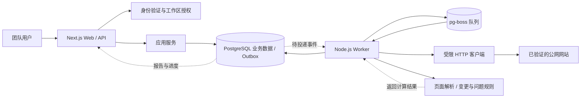
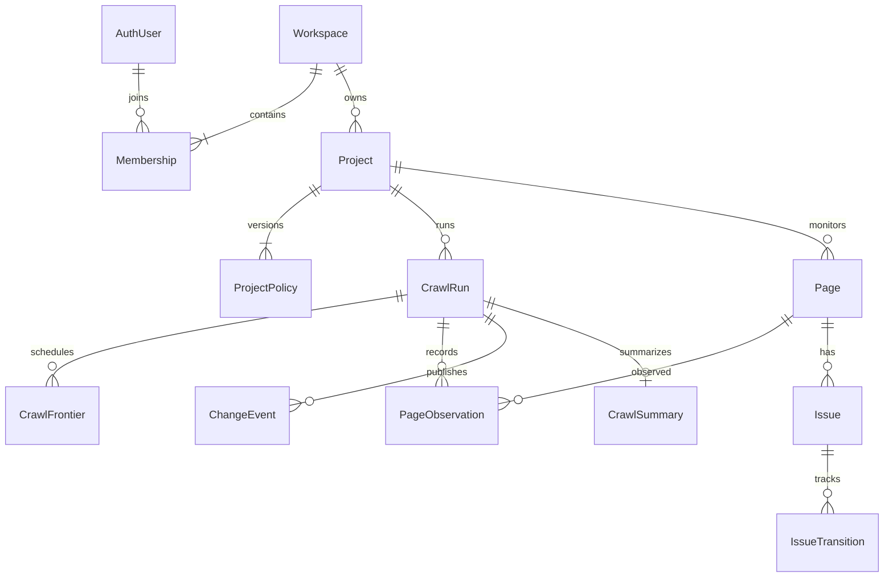
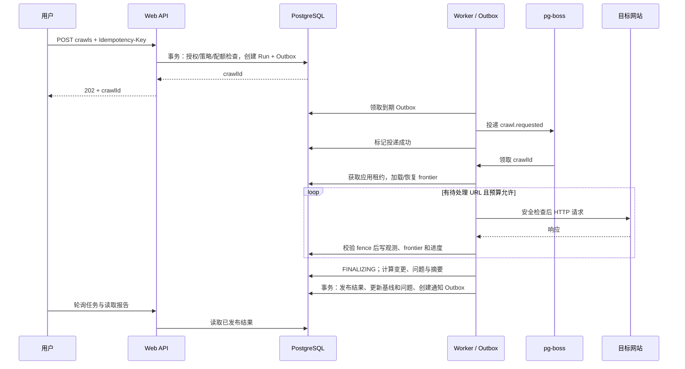
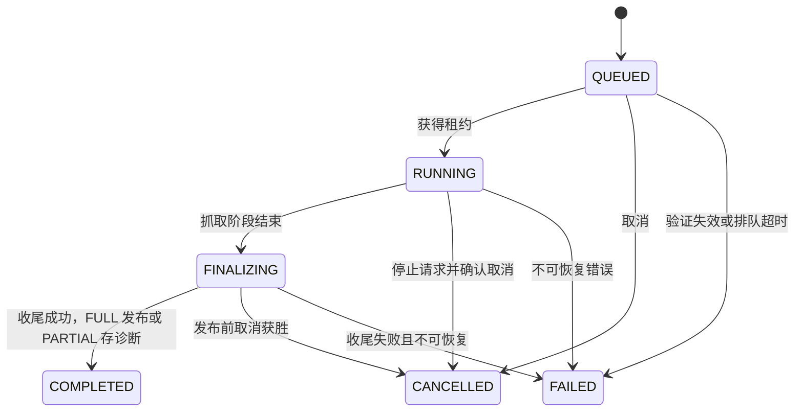

# Indexly 整体架构设计

设计日期：2026-09-06，最近更新：2026-09-07。状态：核心闭环（P0–P4）与站点健康分已按本设计实现；邮件报告、Webhook、链接图等 P5 增强尚未实现。用户已确认首版面向团队或多用户服务。

本文定义产品边界、系统职责、数据契约和运行约束；具体实施顺序见 [IMPLEMENTATION_PLAN.md](./IMPLEMENTATION_PLAN.md)。仓库已包含工作区/项目/抓取/报告/调度/清理等实现，各章描述的语义以已通过测试的行为为准。

## 1. 产品目标与设计范围

Indexly 帮助团队回答：网站自上次有效抓取以来发生了哪些技术 SEO 变化，影响哪些页面，哪些问题仍存在，以及哪些问题已通过重新抓取确认解决。

首版闭环：创建工作区 → 邀请成员 → 创建并验证项目域名 → 手动或每周抓取 → 保存页面观测 → 发布变更报告与问题状态 → 查看证据与历史。

| 范围 | 首版决定 |
| --- | --- |
| 用户组织 | 一个用户可加入多个工作区；工作区内多个项目；成员权限覆盖所在工作区全部项目 |
| 网站类型 | 可公开访问、HTTP 返回内容可解析的网站；不登录目标站点、不执行页面 JavaScript |
| 监控内容 | HTTP 状态、重定向、robots 索引指令、canonical、标题、描述、站内链接数量 |
| 问题管理 | 自动发现、自动确认解决、重新出现、忽略；保留证据和时间线 |
| 抓取触发 | 手动抓取、每周调度；同项目同时最多一个活跃任务 |
| 首版规模假设 | 总计约 50 个活跃项目，每项目最多 5,000 个页面身份；部署容量须压测验证 |
| 后续能力 | 浏览器渲染、链接图与断链溯源、邮件报告、Webhook、第三方 SEO 平台集成 |
| 范围外 | 搜索排名追踪、关键词研究、计费套餐、全网爬取、自动修改客户网站 |

页面只展示有实现依据的指标。站点健康分已按第 9 章的公式、覆盖率门槛与版本策略实现并展示；断链数量等指标在链接图能力（P5）实现后启用。

## 2. 架构决策

采用模块化单体代码库，部署 Web 与 Worker 两种进程，共享 PostgreSQL。抓取工作通过持久化队列执行。



图中的业务表、Outbox、队列都位于同一个 PostgreSQL 实例；队列表使用独立 schema。Worker 内包含队列消费、Outbox 投递、调度扫描和失效任务恢复，不为这些职责增加首版独立服务。

| 层次 | 选型与职责 | 取舍 |
| --- | --- | --- |
| Web 与 API | 保留 Next.js App Router、React、TypeScript；Route Handlers 使用 Node runtime | 延续现有技术栈；HTTP 请求只执行短事务和查询 |
| 身份验证 | Better Auth，数据库会话，邮箱验证与邀请制注册 | 复用身份、会话和凭据处理；工作区授权由业务模块统一负责 |
| 应用服务 | TypeScript 用例服务与数据访问层 | 页面、API 和内部任务复用同一业务约束 |
| 业务数据库 | PostgreSQL + Prisma；少量约束和锁用受审查的参数化 SQL | 数据迁移集中管理；数据库约束承担并发下的最终保护 |
| 任务队列 | pg-boss + 业务 Outbox | 首版复用 PostgreSQL；高抓取负载与业务查询会竞争数据库资源 |
| 抓取 | 独立 Node.js Worker；封装 Node HTTP(S) 客户端 | 能控制 DNS、实际连接地址、重定向和流量预算 |
| 解析与校验 | Cheerio 解析已下载 HTML；Zod 校验配置、API 和任务载荷 | 不执行目标页面脚本；跨进程契约运行时可校验 |
| UI 数据 | Server Components 首屏查询；Client Components 处理交互与任务轮询 | 过滤器存 URL；组件局部状态足够，暂不引入全局状态库 |
| 存储 | 结构化观测与截断证据存 PostgreSQL | 首版不保存原始 HTML、截图、响应 Cookie，也不需要对象存储 |

Next.js 支持 Route Handlers 作为服务端接口；Server Components 可直接调用服务端查询层，避免访问自身 API 的额外往返。[Next.js BFF 文档](https://nextjs.org/docs/app/guides/backend-for-frontend)

pg-boss 提供 PostgreSQL 队列、重试及调度能力；本系统仍按任务可能被重复执行设计业务幂等，不把队列语义等同于网络请求或邮件的业务恰好执行一次。[pg-boss 官方仓库](https://github.com/timgit/pg-boss)

认证库接管身份表与会话校验，业务层维护唯一一套工作区成员关系。不能只通过 Cookie 是否存在判断权限。[Better Auth Next.js 集成](https://better-auth.com/docs/integrations/next)

版本策略：保留现有 Next.js/React 主版本作为迁移起点，统一 Node.js 24 运行环境；实施阶段验证并锁定依赖和 PostgreSQL 镜像版本，提交 lockfile。本文不要求立即升级框架，也不把第三方最新文档中的 API 当作项目已安装版本的保证。

## 3. 代码组织与依赖方向

```text
app/
  (auth)/                         登录、接受邀请
  (workspace)/[workspaceId]/
    projects/[projectId]/         overview / changes / issues / pages / crawls / settings
  api/v1/                         业务 HTTP 接口
  api/auth/[...all]/               认证库接口
components/                       布局、表格、状态、分页、表单
server/
  auth/                           Session -> ActorContext
  services/                       项目、抓取、报告、问题、成员管理用例
  repositories/                   强制工作区作用域的数据库访问
workers/
  main.ts                         进程启动、停机、消费者注册
  crawl/                          抓取编排、frontier、恢复
  maintenance/                    调度、Outbox、清理、失效任务扫描
packages/
  contracts/                      DTO、Zod schemas、枚举、错误码
  crawler/                        URL policy、安全传输、robots、页面解析
  change-detection/               纯快照比较函数
  issue-rules/                    三值规则评估与状态转换
  db/                            Prisma schema、迁移和数据库连接
  queue/                         pg-boss 适配器与任务契约
tests/
  unit/                          纯规则与 URL 策略
  integration/                   PostgreSQL、队列、安全 HTTP 测试服务器
  e2e/                           两次抓取、权限、取消和页面交互
docs/
```

使用 npm workspaces 管理 packages；根目录继续承载 Next.js，无需先搬迁为 apps/web。每个 package 提供显式 exports 和类型检查；迁移现有 `.mjs` 时保留测试用例中的有效业务语义，修改已确认有问题的语义。

依赖方向：页面/API/Worker 编排 → 应用服务或抓取用例 → 纯领域规则与契约；数据库、队列、HTTP 通过适配器接入。纯规则不导入 Next.js、Prisma、队列或网络。浏览器只能导入可公开的契约与 UI，服务端模块使用 `server-only` 等边界保护。

## 4. 团队、权限与项目边界

| 操作 | OWNER | ADMIN | MEMBER | VIEWER |
| --- | --- | --- | --- | --- |
| 查看项目、报告与证据 | 是 | 是 | 是 | 是 |
| 手动抓取、取消抓取、忽略问题 | 是 | 是 | 是 | 否 |
| 创建项目、修改抓取策略、验证域名、配置调度 | 是 | 是 | 否 | 否 |
| 邀请、移除成员、调整非所有者角色 | 是 | 是 | 否 | 否 |
| 分配或撤销 OWNER、删除工作区 | 是 | 否 | 否 | 否 |

不允许移除或降级最后一个 OWNER。ADMIN 不能修改 OWNER。权限变更、邀请接受、删除和抓取触发写审计日志；关键成员变更在锁定工作区的短事务内检查。

所有业务入口先验证会话，再加载当前成员关系，形成 `ActorContext(userId, workspaceId, role)`。客户端传入的 workspaceId 只是定位参数，不构成权限。服务层和 repository 都要求作用域；读取 crawl/page/issue 前校验其所属项目和工作区。

业务子表携带 workspaceId、projectId，并通过组合外键约束关联对象属于同一租户。该约束防止错误关联，读权限仍由授权查询负责。首版不依赖 RLS；集成测试必须覆盖横向越权、角色降级后的写入与缓存隔离，后续 RLS 可作为附加防线。

身份与会话由 Better Auth 管理；工作区邀请表只保存随机令牌哈希、目标邮箱、授予角色、有效期和使用状态。接受邀请要求已验证邮箱匹配，在同一事务中消费令牌并创建 membership。默认邀请 72 小时过期；邀请链接不得出现在日志中。

首版以已验证邮箱和邀请制开放使用。初始 OWNER 通过部署初始化命令创建；验证与密码恢复邮件由认证适配器发送，生产开放注册前必须配置并验证邮件通道。

项目初始为 `PENDING_VERIFICATION`。ADMIN/OWNER 添加 DNS TXT 随机挑战，Worker 校验后转为 `ACTIVE`；首次创建和每次抓取前要求最近 30 天内验证成功。验证过期时手动抓取返回 `409 VERIFICATION_REQUIRED`，调度记录 SKIPPED_UNVERIFIED 并排队重新验证；验证成功后用户可重试，调度按下一槽位执行。已排队的抓取在领取时也检查验证有效性，不满足则 FAILED/VERIFICATION_REQUIRED。主机必须逐个授权，域名所有权不代表允许访问内网。

验证作业通过 Outbox 投递 `{ schemaVersion: 1, type: 'verification.requested', workspaceId, verificationId, challengeVersion }`，状态为 PENDING → RUNNING → SUCCEEDED/FAILED，保存检查时间、错误和尝试次数。项目 GET 返回验证进度；同挑战最多一个活跃检查。挑战轮换后旧作业不得更新验证结果。此消费者与最小 Outbox 运行能力在 P1 一起实现。

首版项目使用一个精确 hostname，允许同 hostname 的 HTTP:80 与 HTTPS:443；子域、www 别名和非默认端口不自动纳入。新增 hostname 应建立独立项目。跨域 canonical 或重定向仅记录，不跟随抓取。

## 5. 数据模型与数据库约束

实体 ID 使用不可预测 ID；时间统一存 UTC，界面按用户时区格式化。JSONB 用于版本化配置、证据和摘要，不替代需要筛选及关联的实体字段。

| 实体 | 关键字段与用途 | 主要约束 |
| --- | --- | --- |
| AuthUser / Session / Account / Verification | 由认证库管理身份和会话 | 使用认证库 schema 与迁移规范 |
| Workspace / Membership / Invitation | 工作区、成员角色、邀请 | membership 唯一 `(workspaceId, userId)`；令牌哈希唯一 |
| Project | hostname、verificationStatus、currentPolicyId、latestPublishedRunId、archivedAt | 工作区内 hostname 唯一；项目归档后停止新任务 |
| ProjectPolicy | version、scopeGeneration、配置 JSON、identityVersion、extractorVersion、ruleVersion、policyHash | 项目内版本唯一；创建后不可修改 |
| DomainVerification | projectId、公开 DNS challengeValue 及哈希、challengeVersion、status、checkedAt、lastError、attempts、verifiedAt、expiresAt | 同挑战最多一个活跃检查；状态改变有审计 |
| CrawlSchedule / ScheduleOccurrence | 下次 UTC 执行时间、间隔、scheduledFor、执行/跳过状态 | occurrence 唯一 `(projectId, scheduledFor)` |
| CrawlRun | projectId、policyId、baseRunId、trigger、status、completeness、comparisonMode、reason、进度、leaseToken、leaseExpiresAt、cancelRequestedAt、finishedAt、publishedAt、detailsExpiredAt | 同项目最多一个活跃 run；baseRun 同项目且已发布 |
| CrawlFrontier | runId、urlKey、requestUrl、depth、source、state、attempts、nextAttemptAt | 唯一 `(runId, urlKey)`；持久化待抓取集合和重试进度 |
| Page | projectId、identityVersion、urlKey、identityUrl、firstSeenRunId、lastSeenRunId | 唯一 `(projectId, identityVersion, urlKey)`；存原文并检查哈希碰撞 |
| PageObservation | runId、pageId、fetchOutcome、HTTP/SEO 字段、fieldValidity、证据、fetchedAt | 唯一 `(runId, pageId)`；run 结束后观测不可变 |
| ChangeEvent | runId、baseRunId、pageId、type、before、after、severity、ruleVersion | 唯一 `(runId, pageId, type)`；发布后不可变 |
| Issue / IssueTransition | pageId、scopeGeneration、ruleKey、ruleVersion、state、occurrence、lastEvaluatedRunId、lastConfirmedRunId/At、证据副本、suppressedUntil；状态转换历史 | issue 唯一 `(projectId, pageId, scopeGeneration, ruleKey, ruleVersion)`；transition 有幂等键 |
| CrawlSummary | runId、schemaVersion、计数、健康分字段（healthScore、healthScoreVersion、healthCoverage、healthReason、healthComponents）、统计 JSON | runId 唯一；随报告原子发布 |
| IdempotencyRecord | actorId、workspaceId、route、key、requestHash、resourceId、expiresAt | 唯一 `(actorId, workspaceId, route, key)` |
| OutboxEvent | type、aggregateId、payloadVersion、payload、availableAt、claimToken、claimUntil、attempts、deliveredAt | 稳定 eventId；业务事件唯一键；可重试投递 |
| ConcurrencySlot / HostRateState / UsageBucket | 部署/工作区执行槽、hostname 在途槽及 nextAllowedAt、配额窗口和已用量 | 槽位唯一且带持有者/租约；hostname 唯一；窗口计数原子更新 |
| AuditLog | workspaceId、actorId、action、resourceId、requestId、redactedDetails、createdAt | 追加写入；禁止凭据和完整抓取正文 |

后续邮件报告增加 NotificationDelivery，唯一键为 `(reportId, recipientId, channel, templateVersion)`；供应商响应和尝试历史单独记录。

主要实体关系如下，详细归属由上表的组合外键约束：



数据库必须实现的约束：

- CrawlRun 的 `(projectId)` 条件唯一索引覆盖 `QUEUED/RUNNING/FINALIZING`，防止并发点击与定时触发产生双任务。PostgreSQL 支持条件唯一约束所需的部分唯一索引。[PostgreSQL partial indexes](https://www.postgresql.org/docs/current/indexes-partial.html)
- 建立 `(workspaceId, projectId, createdAt, id)` 历史游标索引、`(runId, severity, type, id)` 变更索引、`(projectId, state, ruleKey, id)` 问题索引，以及 Outbox/frontier 的到期任务索引。
- URL 最长 8 KiB；urlKey 为规范化字符串的 SHA-256。发现同哈希不同字符串时明确报错，不能静默合并。
- 事务锁顺序统一为部署配额槽（需要时）→ Workspace/配额槽 → Project → CrawlSchedule → CrawlRun → 子记录，同类多行按 ID 排序。调度先无锁找候选，再按此顺序锁定并重查到期时间。hostname 请求许可在独立短事务按 hostname 顺序领取，禁止持其锁再反向获取项目锁。网络 I/O 不在数据库事务中执行。
- 清理历史详情前排除 current baseline、活跃 run 的 baseRunId，以及未完成报告发布引用。CrawlRun 元数据保留，before/after 和 Issue 最近证据保存有界副本；可选 observation 详情引用使用 SET NULL，不能级联删除 Issue。Page 首末 run 与 run 基线关系仍指向保留元数据。

## 6. 页面观测与 URL 身份契约

必须区分三个值：`requestUrl` 是实际请求地址，`identityUrl` 是去重与比较的页面身份，`finalUrl` 是合法重定向链最终到达的地址。页面身份不跟随 canonical 或重定向自动合并。

URL identity v1 默认只执行 URL 标准解析、主机/协议规范化、默认端口规范化和去掉 fragment；保留末尾斜杠、路径大小写、查询参数值、顺序与重复参数。先按原始响应 finalUrl 或有效 `<base href>` 解析相对链接，再计算身份并做 scope、安全检查。

去除跟踪参数、排序参数、路径合并属于显式配置，修改时增加 identityVersion 与 scopeGeneration，建立新基线。现有 `normalizeUrl()` 的无条件末尾斜杠删除和查询参数排序不能直接成为生产默认策略。

页面观测的逻辑结构如下；这是契约草案，实施时以 Zod 与数据库迁移落实：

```ts
type Observation = {
  runId: string;
  pageId: string;
  requestUrl: string;
  finalUrl: string | null;
  fetchOutcome: 'HTTP_RESPONSE' | 'NETWORK_ERROR' | 'ROBOTS_BLOCKED'
    | 'SCOPE_BLOCKED' | 'LIMIT_SKIPPED' | 'SECURITY_BLOCKED';
  initialStatus: number | null;
  finalStatus: number | null;
  redirectChain: Array<{ url: string; status: number; location: string }>;
  contentType: string | null;
  title: string | null;
  metaDescription: string | null;
  canonical: { raw: string[]; resolved: string[]; validity: string } | null;
  robots: { raw: string[]; index: 'ALLOWED' | 'DISALLOWED' | 'UNKNOWN' };
  internalLinksCount: number | null;
  fieldValidity: Record<string, 'KNOWN' | 'UNKNOWN' | 'NOT_APPLICABLE'>;
  failureCode: string | null;
  fetchedAt: string;
};
```

字段语义：空标题是“已解析 HTML 但未找到标题”，解析失败则是 UNKNOWN；通过 fieldValidity 区分，不能把两者都当作 missing title。非 HTML 响应保留 HTTP 事实，HTML 专属字段标为 NOT_APPLICABLE。证据字符串有长度上限，截断文本另存完整内容哈希；仅凭截断前缀相同不能断定完整内容未变。

出现重定向时，源 PageObservation 保存自身 initialStatus、finalStatus 和完整链，其 HTML 专属字段为 NOT_APPLICABLE；最终目标若在 scope 内，作为独立身份加入 frontier 并取得自己的观测。首版允许为此再次请求目标页，计入速率与预算。不能将目标的 200 或标题回填成源页面自身恢复健康的证据。

提取 robots meta 和 X-Robots-Tag，保留原始指令，按通用及 Googlebot 适用规则合成索引状态；`noindex` 与 `index,follow` 不通过原始字符串相等判断。robots.txt 的访问限制与页面索引指令是不同字段，页面不被允许抓取时不能推断其索引状态。[Google robots meta 与 X-Robots-Tag](https://developers.google.com/search/docs/crawling-indexing/robots-meta-tag)

canonical 解析为候选集合，保留缺失、多值、无效与跨域情况；跨域 canonical 本身不自动等同于错误。站内链接数量按同一 scope/identity 策略计算页面内不同目标数，不代表这些目标已抓取或链接健康。

## 7. 抓取任务、队列与一致性



### 7.1 创建、投递和重试

API 在一个业务事务里写 CrawlRun、IdempotencyRecord 和 OutboxEvent；不直接把“数据库插入成功”与单独 `queue.send()` 拼成成功请求。同一个 PostgreSQL 实例不意味着不同客户端调用自动共享事务。

Outbox 按到期时间领取，提交领取租约后投递队列，成功后凭 claimToken 标记 delivered，过期领取者不能覆盖新状态。投递成功但标记前崩溃会重复投递，因此抓取载荷只有稳定 ID 与版本：`{ schemaVersion: 1, type: 'crawl.requested', workspaceId, crawlId }`。Worker 重新从数据库读取任务、策略和项目状态，不能信任载荷中的权限或 URL。

一个 crawl 对应一个逻辑队列作业；URL frontier 在业务表持久化，Worker 内部执行有界并发。重复投递遇到终态直接成功返回；已有有效应用租约则推迟消费；租约过期才可接管。不能让重复作业失败回调把仍在运行的 crawl 标成失败。

应用租约默认 60 秒，15 秒续约，使用数据库时间。每次接管递增 leaseToken。写观测、frontier、状态或发布报告时，在同一短事务中锁定 CrawlRun 并校验 token、有效期和取消状态；失去租约的旧 Worker 禁止继续写入。先检查 token、再单独写入不满足此约束。

Worker 崩溃后，过期的 FETCHING frontier 重置为待处理，已提交观测不重复计算。可能再次发出 HTTP GET，但唯一键与 fencing 防止重复报告。状态码 404/410/5xx 是 HTTP 观测；DNS/连接/解析失败不是伪造的状态码。

页面级可重试故障最多重试 2 次，指数退避并带抖动；429/503 的有效 Retry-After 推迟整个 hostname 的请求许可，超过剩余时长则结束为 PARTIAL，不能缩短服务端要求的等待。429 记为限流导致的观测不足，不能当作普通 SEO 页面问题。Worker 进程故障可恢复同一 run 最多 3 次，仍受首次开始时间计算的总时限约束。队列作业过期时间显式设置为大于抓取总时限和收尾余量，不能沿用短任务默认值。

每分钟恢复扫描检查过期租约、长期 QUEUED、Outbox 投递失败和队列终态与业务状态不一致。可恢复任务重新投递；超出预算的任务标记 FAILED 并记录明确原因。队列作业完成不直接代表 CrawlRun 已发布。

### 7.2 状态与取消



租约恢复维持当前阶段，终态不回退。“重试失败抓取”创建新 crawlId；内部进程恢复沿用原 crawlId。

QUEUED 任务由取消 API 在事务内直接置为 CANCELLED，不等待队列消费者；活跃租约已过期时也可递增 fence 后直接取消。RUNNING/FINALIZING 且租约有效时写 cancelRequestedAt，Worker 停止发现新 URL 并中止在途请求。取消与发布锁定同一 CrawlRun：取消先提交则禁止发布；发布先提交则取消返回 `409 CRAWL_ALREADY_FINISHED`。对已取消任务重复取消返回原 CANCELLED 状态。忽略陈旧 Worker 的迟到写入。

### 7.3 范围、发现与预算

种子由项目入口、允许的 sitemap URL、上次有效基线中的受监控 URL 构成。已有受监控 URL 优先复查，再按深度优先级和稳定 URL 顺序处理新发现页面；不因链接消失而跳过历史页面。

抓取入口、robots.txt、sitemap、页面链接和每次重定向都走同一个安全传输层，负责 scope、DNS、连接与预算。robots 策略在上层执行；下载 robots.txt 自身免于前置 robots 判定，避免递归检查。sitemap 递归深度最多 3 层、文档最多 20 个、候选 URL 最多 20,000 个，XML 禁用 DTD/外部实体。Cheerio 只解析已取得的文档，不调用其联网加载入口。[Cheerio 官方说明](https://cheerio.js.org/docs/intro/)

普通 scope 外链接在发现阶段过滤，不加入 frontier、不使任务变成 PARTIAL。已纳入范围的目标被安全校验拦截则记录 SECURITY_BLOCKED 并使本轮不可发布；根 URL 重定向到 scope 外时以 ROOT_OUT_OF_SCOPE 失败，提示调整项目。

| 预算 | 初始默认值 | 达到上限的处理 |
| --- | --- | --- |
| 单项目页面 / frontier | 5,000 / 20,000 个 URL | 停止扩展，标记 PARTIAL 与 LIMIT_REACHED |
| 抓取时长 | 2 小时，收尾另留 10 分钟 | 中止在途请求，保存部分结果 |
| 单响应正文 | 传输与解压后均最多 2 MiB | 中止响应，记录 BODY_TOO_LARGE |
| 单次抓取正文总量 | 500 MiB；包含重试和辅助文档 | 标记 PARTIAL |
| 重定向 | 最多 5 跳 | 保存链，超限记录 REDIRECT_LIMIT |
| 页面请求 | DNS/连接各 5 秒，单次整体 20 秒 | Abort 并按策略重试 |
| 站点速率 | hostname 全局最多 1 请求/秒，最多 2 个在途请求 | PostgreSQL 协调配额，重定向和 robots 同样计入 |
| 活跃抓取 | 项目 1、工作区 2、部署初始 4 | 未获得配额时延迟重投并释放消费者 |
| 手动触发 | 每项目每日最多 10 次；创建间隔至少 5 分钟 | 429，并返回下次允许时间；工作区另有可配置存储配额 |

配额不是只放在进程内的计数器；多个 Worker 使用数据库租约槽协调并发，hostname 配额跨工作区共享。执行槽随 crawl 租约续约和恢复；hostname 在途槽随请求释放或过期回收。任务无法取得工作区/部署槽时释放消费者并延迟重投，不占执行位空等；按工作区轮转择取可运行任务，避免一个团队堵住全部消费者。容量表是初始保护值，完成压测后可调整。5,000 个页面在每秒 1 个请求且无额外开销时也需约 83 分钟，页面预算不构成时长承诺。

遵守 robots.txt 中适用于 IndexlyBot 的规则。robots 不存在的 404/410 允许继续；401/403 采用保守拒绝策略；429/5xx/网络故障暂停并重试，耗尽后不继续抓取。这里对部分 4xx 的限制是本产品比协议更保守的决定。根范围被完全禁止时 FAILED/ROBOTS_DENIED，不能发布空基线。[RFC 9309](https://www.rfc-editor.org/rfc/rfc9309.html)

robots 按 origin 缓存，最长 24 小时，保存至少 512 KiB 解析预算和响应哈希供追溯；本轮冻结已取得的规则。首版不跟随 scope 外 robots 重定向，记录 ROBOTS_UNAVAILABLE 并停止对应 origin 的抓取，这是比 RFC 跨源重定向建议更保守的产品边界。其他未列出的异常状态也保守停止，不能按“文件不存在”放行。

## 8. 完整性、基线和发布语义

`status` 描述任务生命周期；`completeness` 描述观测质量；`comparisonMode` 描述是否存在可比基线，三者分开保存。

| 结果 | 条件 | 报告与基线行为 |
| --- | --- | --- |
| FULL | 配置范围内 frontier 处理完，无预算截断、未恢复网络/解析错误，至少一条有效 HTTP 观测 | 可以发布；仍只对 KNOWN 且适用的字段作比较 |
| PARTIAL | 抓取达到上限，或存在未恢复的抓取/解析故障 | 保存诊断与逐页观测；首版不发布变更、不改变问题状态、不推进基线 |
| NONE | 无有效 HTTP 观测，或尚未产生观测 | 不建立基线；记录失败或进行中原因 |

收尾的终态规定：FULL 成功为 COMPLETED 且 publishedAt 非空；PARTIAL 为 COMPLETED、publishedAt=null，冻结观测与诊断并设置 finishedAt，释放项目活跃约束；NONE 在处理结束后为 FAILED。取消始终为 CANCELLED。comparisonMode 在未发布时为 NONE，FULL 发布时为 BASELINE 或 DIFF。

robots/scope 主动阻止的 URL 留下独立观测，其 SEO 字段为 UNKNOWN/NOT_APPLICABLE；这类页面不能被视为删除或已修复。FULL 只表示按配置策略完成遍历，不声称覆盖整个网站。

基线选择：创建任务时固定当前策略兼容的最近已发布 FULL run；兼容要求 scopeGeneration、identityVersion、extractorVersion 和 ruleVersion 相同。没有基线且本次 FULL 发布时 `comparisonMode=BASELINE`，变更数量显示“建立基线”，而不是把全部页面报成新增；仍评估当前页面可确认的问题。

修改会影响比较语义的配置生成新策略版本和 scopeGeneration。首版在项目存在活跃 run 时拒绝这类变更，返回 `409 CRAWL_ALREADY_ACTIVE`，在 Project 锁内与创建抓取/发布互斥；项目名称等展示设置可修改。归档同样要求先取消并等待任务终态。策略发布/解析器升级也遵循此门槛，运行中的任务保留匹配版本处理器直至完成。

下一个 FULL run 建立新基线，旧问题以 `ARCHIVED/POLICY_CHANGED` 归档，不计入已解决；旧报告保留原策略解释。新基线发布前展示“策略已变更，等待基线”，并标明旧报告版本。

首版对 PARTIAL 采用保守发布策略，代价是其中已观测到的严重变化不会进入正式告警。页面必须突出“报告未更新”和原因；后续若引入逐页部分发布，需要单独设计每字段基线和通知去重，不能直接去掉此门槛。

进入 FINALIZING 时停止观测写入；FULL 必须没有待处理、等待重试或有效在途 frontier，PARTIAL 则先中止请求并为剩余项记录跳过原因。FULL 收尾在事务外基于冻结观测计算候选事件和 PRESENT/ABSENT/UNKNOWN 评估，再以短事务锁定 Project/CrawlRun，复核 lease、取消、策略与基线引用。事务内读取最新 Issue 状态及忽略设置，计算转换和摘要，写事件、问题、publishedAt、latestPublishedRunId 及报告 Outbox。忽略操作也使用 Project 锁，不能把事务外陈旧状态覆盖到最新设置。

限制首版规则数和页面数，使发布事务大小有界；超过压测阈值后改为分批暂存加版本指针原子切换。PARTIAL 只提交诊断收尾，不执行上述发布事务。任何版本复核冲突均明确以 FAILED/POLICY_CONFLICT 收敛，不对同一不兼容任务无限重试。

读接口仅暴露已发布的 ChangeEvent 与 Summary；未发布观测通过带明确状态的 crawl 详情读取。通知只消费发布事务产生的 Outbox，不在抓取中逐页发送。

## 9. 变更事件、问题与指标

变更是“两次可比较观测之间的事实”，问题是“某条规则现在是否仍成立”。标题从 A 改为 B 可以产生 WARNING 事件，但不必产生一个需要解决的问题。

| 事件 | 默认严重程度与条件 |
| --- | --- |
| HTTP_STATUS_CHANGED | 比较 initialStatus；2xx → 404/410/5xx 为 CRITICAL，其他 INFO |
| FINAL_HTTP_STATUS_CHANGED | 存在重定向时比较最终 HTTP 状态；严重程度同上；初始和最终事件在无重定向时不重复生成 |
| REDIRECT_CHANGED | 重定向目标或链变化，WARNING；外部目标只记录 |
| ROBOTS_CHANGED | 已知 ALLOWED → DISALLOWED 为 CRITICAL；反向 INFO |
| CANONICAL_CHANGED / TITLE_CHANGED / META_DESCRIPTION_CHANGED | 可判定字段变化为 WARNING |
| INTERNAL_LINKS_CHANGED | 已知站内不同目标数变化，INFO |
| URL_ADDED | 已存在基线时新增受监控身份，INFO |

内容类事件（title/meta/canonical/内链数量）要求前后都是同一页面身份直接返回的成功 2xx HTML、相关字段 KNOWN；错误页与重定向源不参与内容比较。HTTP、重定向和响应头规则按各自有效性评估，避免一次 500 同时被解释为标题、描述和 canonical 全部删除。

不生成“未出现在本轮集合 = URL_REMOVED”的事件。URL 返回 404/410 是状态证据；未被发现、被 robots 阻止、抓取超限、网络失败都不是删除证据。主动移出监控范围属于配置审计。新 URL 的当前异常由问题规则评估，不因 URL_ADDED 后提前返回而漏掉。

首版规则：HTTP 404/410/本轮重试耗尽后仍为 5xx、预期可索引页面的 noindex、HTML 缺少标题、canonical 格式无效或存在冲突多值。项目可为路径设置 `expectedIndexability=ANY` 避免对合法 noindex 报警。canonical 缺失、跨域 canonical、标题变化不默认认定为当前问题；断链溯源推迟到链接图实现。

每条规则返回 `PRESENT / ABSENT / UNKNOWN` 和证据；只有在该规则前置条件满足时才返回 ABSENT。例如 500 错误页或非 HTML 响应不用于确认“原标题缺失已修复”；HTTP 错误规则和 HTML 规则各自定义可判定条件。

Issue 生命周期为 OPEN → RESOLVED → OPEN；同一规则再次出现增加 occurrence，并追加 IssueTransition。UNKNOWN 保持原状态，更新 lastEvaluatedRunId，但不更新 lastConfirmedRunId/At；证据新鲜度以最近可判定确认衡量。ARCHIVED 用于策略/范围退出，不计修复。忽略是独立的 suppressedUntil/原因/操作者，仍继续评估，不伪装为解决。

| 页面指标 | 统一口径 |
| --- | --- |
| URLs crawled | 当前已发布 run 中 initialStatus 为 KNOWN 的不同 pageId 数；404 和重定向源也计入；重复尝试不重复计数 |
| Changes detected | 变更事件条数；另列 affectedPages 去重页面数；一个页面可能有多个事件 |
| Open issues | 当前策略有效范围内 OPEN 且未被忽略的问题数，同时展示证据过时数量 |
| Resolved | 当前发布事务产生的 OPEN → RESOLVED 转换数；所有卡片共用同一 summary |
| Last crawled | 最近已发布抓取的实际完成时间；旁边独立展示正在运行/最近失败/部分完成 |
| Site health | 发布摘要携带的站点健康分 v1；仅在决定性覆盖率达标时给出分数，否则展示覆盖率与原因，见下文 |

Overview 默认展示同一个 publishedRunId 的统计；忽略操作只改变问题列表的当前可操作计数，抓取时摘要不可改写，二者明确标注时间口径。日期筛选用于历史报告/事件区间，不与最新抓取指标混合求和。

### 站点健康分 v1

健康分由纯规则包 `@seo/health-score` 实现，在发布事务内计算并与摘要原子写入 CrawlSummary。公式为扣分制：

```
score  = max(0, 100 − Σ 扣分(规则))
扣分(规则) = round(权重(规则) × min(1, 受影响率 / 0.2))
受影响率    = min(1, 该规则未解决问题数 / 决定性页面数)
```

决定性页面数即 urlsCrawled（本轮 HTTP 有决定响应的不同页面）；未解决问题按当前策略范围（OPEN 且未忽略）逐规则计数，跨 run 遗留的问题仍计入，受影响率封顶为 1。v1 使用单一分母保持可解释，不建模逐字段适用性（如非 HTML 页面没有标题）。

| 规则 | 权重 |
| --- | --- |
| http_4xx_5xx | 40 |
| noindex_on_indexable | 25 |
| missing_title | 20 |
| canonical_conflict | 15 |

覆盖率门槛：决定性页面数不足 1，或决定性页面占全部观测（含 robots 阻止等无页面证据的观测）的比例低于 50% 时不给分，记 `reason=INSUFFICIENT_COVERAGE` 并保存覆盖率比例；界面据此解释“有效覆盖不足，暂不评分”，不展示猜测值。robots 阻止等非决定性观测不降低抓取完整性，但会推迟评分。

版本与前向兼容：权重、饱和率（20%）、门槛或聚合语义的任何变更都递增 scoreVersion，已存分数保留原解释。权重表之外的规则键不影响分数，单独以 unrecognizedRules 暴露给运维观测。

展示契约：overview API 仅在摘要被评过分（healthScore 或 healthReason 非空）时返回 health 对象，含 score、scoreVersion、coverage、reason 与 components 扣分明细；分数按 good（≥90）/ fair（≥75）/ poor（≥50）/ critical（<50）分级着色。早于评分功能的历史摘要返回 null，界面显示“本报告早于评分功能发布”。

## 10. HTTP API 与前端契约

业务 API 前缀为 `/api/v1`。以下 `{w}`、`{p}`、`{c}` 是路径参数，均需授权验证。列表使用 `(createdAt,id)` 或固定排序键的游标分页，默认 50、最多 100 条；筛选字段采用白名单。

| 方法与路径 | 行为 |
| --- | --- |
| GET /workspaces | 当前用户可访问工作区 |
| POST /workspaces | 创建工作区并授予创建者 OWNER，执行用户配额检查 |
| GET /workspaces/{w}/members | 成员列表 |
| POST /workspaces/{w}/invitations | 创建一次性邀请；角色不可越权授予 |
| POST /invitations/accept | 消费邀请令牌并校验已验证邮箱 |
| PATCH /workspaces/{w}/members/{memberId} | 修改角色 |
| DELETE /workspaces/{w}/members/{memberId} | 移除成员，保护最后一个 OWNER |
| GET / POST /workspaces/{w}/projects | 项目列表 / 创建项目和域名挑战 |
| GET / PATCH /workspaces/{w}/projects/{p} | 项目详情 / 更新设置，使用版本号防止覆盖 |
| POST /workspaces/{w}/projects/{p}/verification | 排队执行 DNS 验证，202 返回验证 ID |
| POST /workspaces/{w}/projects/{p}/crawls | 创建手动抓取，202 返回 crawlId 与 statusUrl |
| GET /workspaces/{w}/projects/{p}/crawls | 抓取历史，含完整性与比较模式 |
| GET /workspaces/{w}/projects/{p}/crawls/{c} | 进度、错误、覆盖、摘要、baseRunId |
| POST /workspaces/{w}/projects/{p}/crawls/{c}/cancel | 请求取消；202 或已终态的 409 |
| GET /workspaces/{w}/projects/{p}/overview | 固定 publishedRunId 的仪表盘数据与任务状态 |
| GET /workspaces/{w}/projects/{p}/changes?runId=... | 按事件类型、严重程度、页面筛选 |
| GET /workspaces/{w}/projects/{p}/issues | 当前问题及证据新鲜度；支持状态和忽略筛选 |
| PATCH /workspaces/{w}/projects/{p}/issues/{issueId} | 仅调整忽略状态，不能手工声称已修复 |
| GET /workspaces/{w}/projects/{p}/pages | 页面列表和最近观测状态 |
| GET /workspaces/{w}/projects/{p}/pages/{pageId}?runId=... | 字段证据、重定向链、变更与问题时间线 |
| GET / PUT /workspaces/{w}/projects/{p}/schedule | 读取 / 设置每周计划和展示时区 |
| GET /workspaces/{w}/audit-logs | OWNER/ADMIN 查看审计记录 |

API 表中的路径均相对业务前缀。认证库 `/api/auth/*` 使用其自身契约。永久删除工作区留到具备保留期、备份与清理流程的阶段；首版项目归档通过 PATCH 完成。

创建抓取必须携带 Idempotency-Key，作用域为用户、工作区和包含实际 projectId 的规范化具体路径，保存 24 小时。requestHash 纳入路径参数和请求体；同键同请求返回原资源，同键不同请求返回 409。重放前重新验证当前成员关系和目标资源权限。同项目已有其他活跃任务返回 `409 CRAWL_ALREADY_ACTIVE` 与有权访问的现有 crawlId。调度使用 ScheduleOccurrence 的唯一槽位，不依赖用户幂等键。

```json
{
  "data": {
    "crawlId": "cr_example",
    "status": "QUEUED",
    "statusUrl": "/api/v1/workspaces/ws_example/projects/pr_example/crawls/cr_example"
  },
  "requestId": "req_example"
}
```

错误格式为 `{ error: { code, message, details? }, requestId }`。使用 400 表示输入无效、401 未登录、403 无操作权限、404 无权看到或资源不存在、409 冲突、429 配额/限流、503 依赖暂不可用；details 不包含内部地址、SQL 或其他工作区资源。

会话 Cookie 使用 HttpOnly、Secure 和适当 SameSite；业务写接口验证 Origin/CSRF，不以使用认证库代替业务 API 的 CSRF 检查。所有认证页面/API 的租户数据禁用共享缓存；未来加入缓存必须把 workspace、权限与版本纳入键。

前端首屏通过授权服务读取数据；运行任务每 3 秒轮询一次，后台标签页暂停，网络错误退避，终态停止轮询并刷新报告。不能从按钮定时器推断任务完成。空项目、首次基线、部分抓取、失败、权限不足和策略变更都提供明确状态。

详情列表保持 runId 和筛选器在 URL；翻页期间固定同一 runId。菜单、项目切换和移动导航需要实际路由/交互；图标按钮提供可访问名称，任务状态提供可访问播报。

## 11. 抓取安全边界

`assertSafeCrawlUrl()` 将拆为语法校验、scope 校验、DNS/IP 校验与连接校验；所有出站抓取路径必须经过这一边界。现有 fc/fd 域名前缀误判、IPv4-mapped IPv6、link-local 和尾点 localhost 漏洞必须通过回归测试修复。

1. 只允许 HTTP/HTTPS 默认端口；拒绝 URL 用户名密码、不合法主机、localhost 及其尾点/子域变体；限制 URL、响应头和重定向 Location 长度。
2. 对 IPv4/IPv6 做地址类型解析和 CIDR 分类；IPv4-mapped IPv6 还原后校验。拒绝 loopback、私有、link-local、未指定、组播、保留及其他非公网目标；不能对普通域名直接做 fc/fd 字符串前缀判断。
3. 解析全部 A/AAAA；含任何禁止地址即拒绝本次请求。将选中的已验证地址绑定实际 TCP 连接，保留原 hostname 的 Host、TLS SNI 和证书验证；不得检查 DNS 后让客户端再次任意解析。
4. 关闭自动重定向；每跳重新进行 scope、地址解析与预算检查，页面请求额外进行 robots 判定，robots 文件获取自身不递归做该判定。到 scope 外只记录 Location。连接复用限于已验证的同一主机/IP；首版可关闭跨请求复用，优先保证边界可验证。
5. 不转发用户 Cookie、Authorization 或任意自定义请求头。抓取客户端不继承不受控的系统代理，不允许代理绕过地址校验；测试环境的本地站点仅通过独立测试适配器提供。
6. 网络层仅允许 DNS、指定数据库和受控公网 HTTP(S) 出站；数据库内网目的地址/端口有明确例外，其他内网和云 metadata 地址阻断。网络限制与应用校验共同生效。

地址和 DNS/重定向防护参考 [OWASP SSRF 指南](https://cheatsheetseries.owasp.org/cheatsheets/Server_Side_Request_Forgery_Prevention_Cheat_Sheet.html)。实际连接控制基于 Node HTTP(S) 的连接适配能力设计，实施时必须验证 DNS 绑定、TLS 和代理场景。[Node HTTP 文档](https://nodejs.org/api/http.html)

目标网页和 URL 都是不可信输入。渲染证据使用文本转义，不渲染抓取 HTML；外链只允许 HTTP(S)。日志默认去掉 URL 查询参数，报告访问受租户权限控制。凭据、邀请令牌、Cookie、邮件令牌不得进入抓取记录或日志。

## 12. 调度、通知与运行部署

每周计划保存 `nextRunAt` UTC、间隔和展示时区；首版按固定 7 天间隔执行，夏令时可能改变本地显示小时，设置页明确说明。需要“每周当地星期几几点”的日历调度时另行引入 DST 规则。

调度扫描器领取到期计划，在同一事务中写 ScheduleOccurrence、创建 CrawlRun/Outbox 并推进 nextRunAt。同项目忙时记录 SKIPPED_BUSY；系统停机错过多个周期时只补最近一次，其余记为跳过，避免恢复后堆积。多个扫描器通过行锁和唯一键防重。

首版提供站内报告和任务失败状态；后续邮件按一次已发布 run 合并发送，允许严重程度过滤。邮件发送失败不回滚报告。Outbox 和 delivery 唯一键减少重复；提供商不支持幂等时，承认“发送成功但确认前崩溃”可能重复，不能宣称绝无重复。

本地环境：PostgreSQL 容器 + Next.js 开发进程 + Worker 开发进程；Windows 使用 npm.cmd 兼容当前 PowerShell 执行策略。生产环境：TLS 入口、Web 容器、Worker 容器、受保护的 PostgreSQL。Web 和 Worker 使用同一构建版本，Worker 按任务类型限制并发。

部署时先运行一次数据库迁移，再发布兼容的新 Web/Worker；pg-boss schema 迁移由独立部署步骤完成。运行账号无 DDL 权限，迁移账号单独保存。破坏性表变更采用先扩展、再迁移数据、最后清理的方式，避免旧任务在升级中失效。

Worker 停机时停止领取新任务，取消在途请求，提交已有结果并释放租约；数据库不可用时停止新增抓取，避免产生无法保存的结果。抓取执行数据不依赖本地磁盘，容器重建后从 frontier 恢复。

运行配置包括 DATABASE_URL、AUTH_SECRET、APP_ORIGIN、认证邮件配置、抓取 User-Agent/联系地址、工作区与网络预算。密钥通过部署环境提供；仓库只提供无真实值的 `.env.example`。配置 schema 在启动时校验。

## 13. 可观测性、容量和保留

结构化日志关联 requestId、workspaceId、projectId、crawlId、jobId、leaseToken；记录任务阶段、耗时与失败码。Web 提供存活和数据库就绪探针，Worker 上报心跳与队列处理时间；详细依赖状态只对运维可见。

监控：队列等待时间、过期租约、Outbox 最老未投递时间、抓取成功/部分/失败率、DNS/robots/限流错误、每站请求速率、数据库查询耗时、连接池用量、每次抓取下载量与存储增长。Outbox 超过 5 分钟未投递、取消超过 30 秒未确认、Worker 心跳丢失应触发运维告警。

首版验收目标是正常负载下创建抓取 API P95 < 500ms、分页查询 P95 < 1s、任务进度延迟 < 10s；这些是待测目标，不是现有性能数据。外部站点速度不计入 API 响应 SLA。取消的 30 秒目标需覆盖请求中止与轮询耗时。

保留默认值：抓取观测/事件详情 90 天、每项目最多保留 20 个已完成 run 的详情；两条清理条件任一满足即可清理，但基线与活跃比较引用始终保留。轻量 CrawlRun、策略及 Summary 元数据保留到项目最终删除，不通过 baseRunId 级联删除报告链；详情清理后设置 detailsExpiredAt，API/界面返回“历史详情已过期”。Issue 最近证据保存副本，原观测详情引用置空；Page 首末 run 引用仍有效。

失败或完成 frontier 在任务 finishedAt 后 7 天可清理，不能按行创建时间删除活跃任务数据。审计日志 180 天；问题保留当前状态、最近证据及 90 天窗口内转换。所有元数据仍计入工作区存储配额，后续永久删除通过受审计的项目清理流程处理。

50 个项目 × 5,000 页面 × 13 次周抓取约产生 325 万条观测。若每条逻辑数据按 1 KiB 估算，仅正文约 3.1 GiB，实际还需索引、行开销、事件、WAL 和备份；上线前必须用真实样本测量。限制手动触发频率和存储配额，避免按周估算被频繁手动抓取突破。

数据库执行自动备份并定期恢复演练；生产目标 RPO ≤ 1 小时、RTO ≤ 4 小时，需要配置连续 WAL 归档/托管 PITR 和实测恢复过程后才算满足。多 Worker 横向扩容时优先观察数据库与站点配额，不按实例数无限增加请求。

当单项目超过首版页面预算、数据库队列持续挤占查询资源，或需要浏览器渲染时，再分别评估页面批任务、独立队列实例/Redis、观测分区/对象存储及隔离浏览器池；通过既有适配器扩展，不改变报告语义。

## 14. 架构验收与当前迁移点

架构必须通过以下行为验证：

- 工作区 A 的用户不能通过替换路径 ID、游标、任务载荷或缓存读取/修改 B 的数据。
- 两次并发点击、手动与定时同时触发、Outbox 重复投递，都只产生一个有效活跃抓取和一份已发布报告。
- 抓取中杀死 Worker、旧 Worker 恢复、发布前崩溃，都不会丢失已确认观测或重复变更/问题转换。
- 首次抓取建立基线；第二次受控修改正确产生事件和问题；第三次恢复得到有证据的解决记录。
- 超时、页面上限、取消和部分抓取不制造 URL 删除或问题已解决，也不推进基线；局部 robots 阻止只使相应字段未知，已完成范围内其他有效观测可按 FULL 规则发布。
- SSRF 回归覆盖普通 fc/fd 公网域名、IPv4/IPv6 私网、mapped 地址、DNS rebinding、重定向到内网及代理绕过。
- UI 指标可追溯到同一 runId；事件数与受影响页面数明确区分；任务失败时不显示模拟成功。
- 健康分可追溯到 scoreVersion、覆盖率与逐规则扣分明细；覆盖率不足时展示原因而不是猜测分数；未注册权重的规则键不参与扣分。

原迁移点已全部完成：`app/page.tsx` 已改为真实数据的仪表盘（统计、变更、问题、历史、任务控制）；`packages/crawler` 已迁移为有类型的 URL policy 与安全传输模块；`packages/change-detection` 保留纯函数结构并落实观测有效性、基线和规则版本契约。健康分以 `@seo/health-score` 纯规则包实现，发布事务、API 与仪表盘已接线；后续 P5 增强（邮件、Webhook、链接图、渲染抓取）按各自需求单独设计。

本次架构设计已确定服务拓扑、租户模型、数据关系、队列一致性、发布语义和 API 边界。部署厂商、邮件提供商及锁定后的依赖补丁版本属于实施配置选择，不阻塞基础开发；所有安全、数据一致性和完整性验收条件均应保留。
